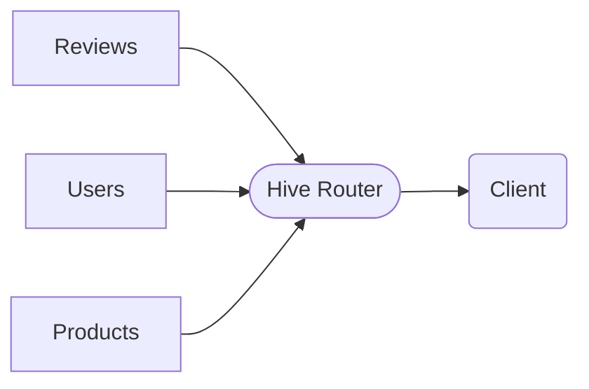
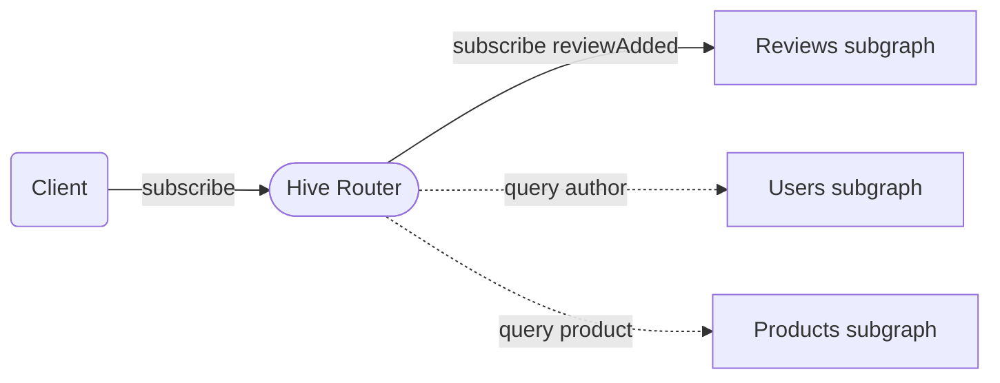
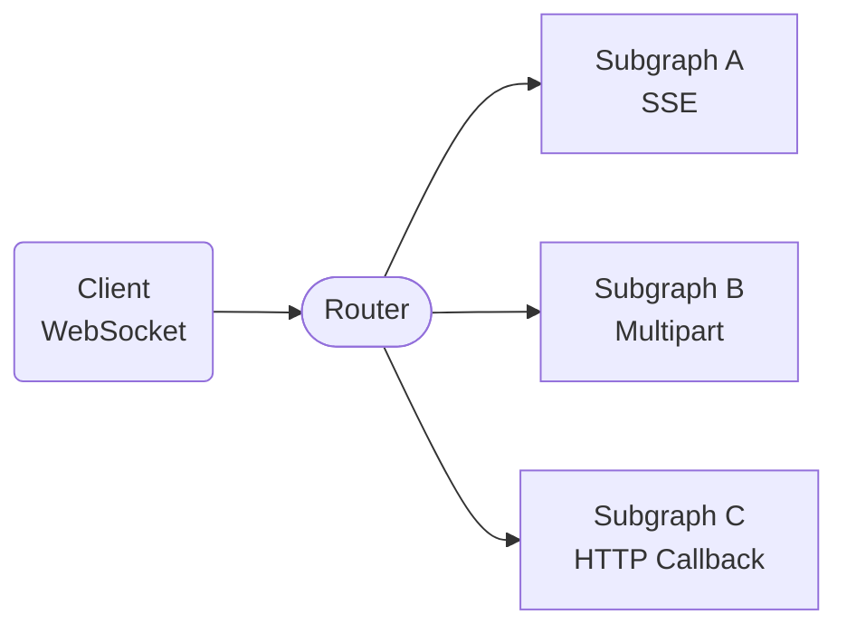
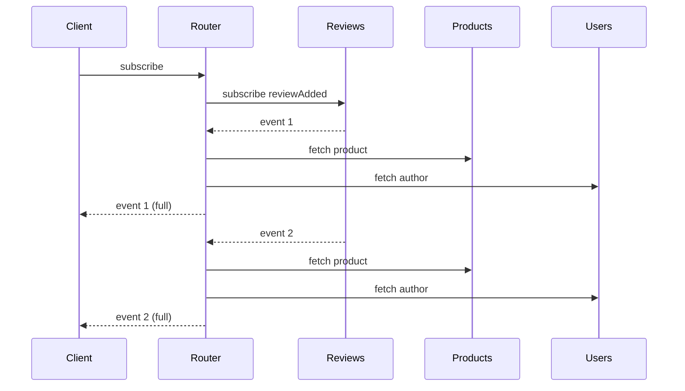
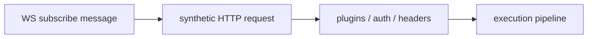
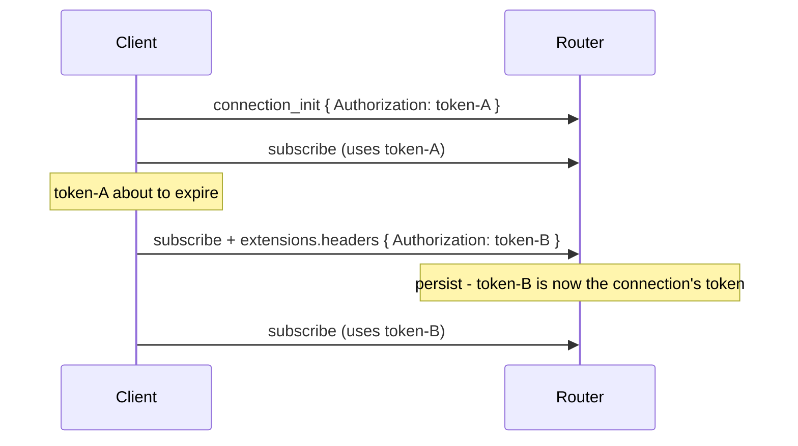
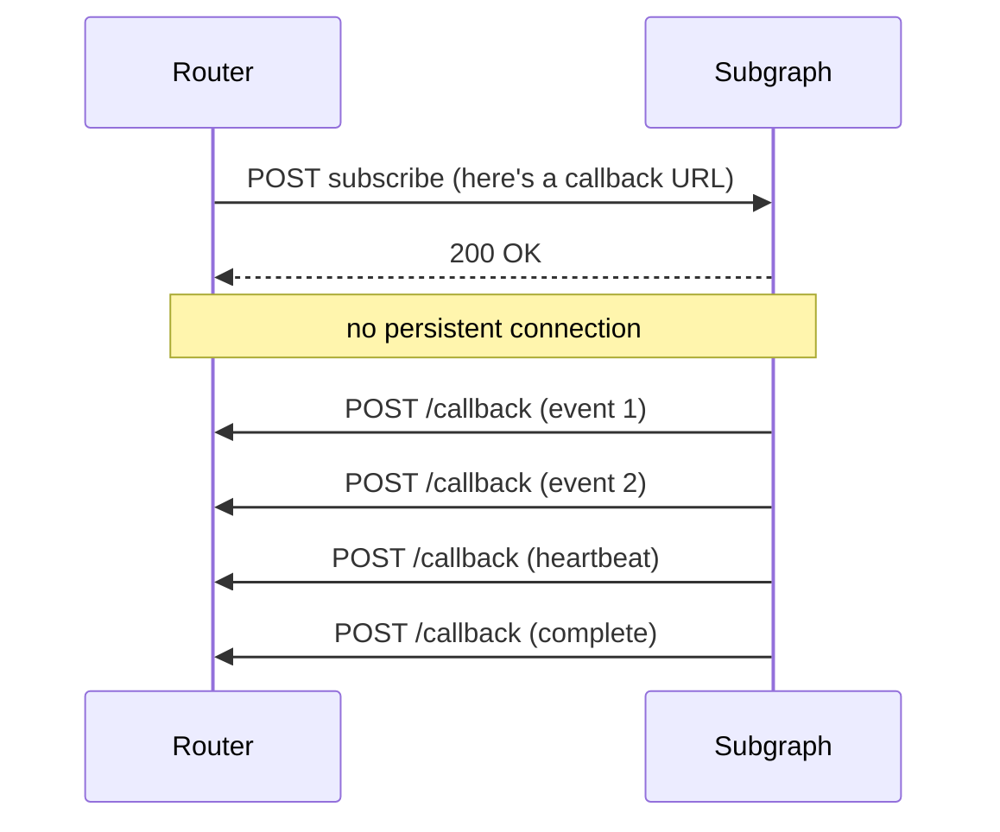
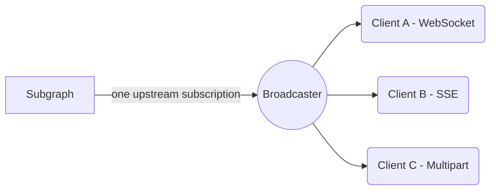
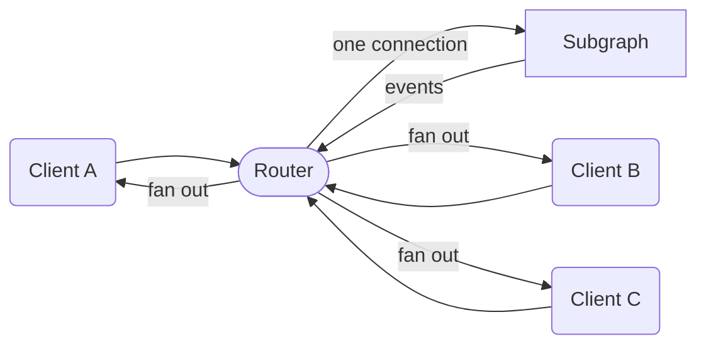

<h1 style="margin-top: 200px; font-size: 2.6rem; line-height: 1.2">
Scaling Real-Time:<br>Building Federated Subscriptions in Rust
</h1>

Denis from **The Guild**

<!--
- Hi everyone, thanks for being here.
- I want to take you through what it actually means building federated GraphQL subscriptions.
- For we have built just that, in Hive Router.
-->

---

# About Me

I work at The Guild, the team behind your GraphQL tooling


<br/>

## Denis

- [`@enisdenjo`](https://github.com/enisdenjo)
- [the-guild.dev](https://the-guild.dev/)
- Software Developer

<!--
- But before all that,
- Let me start by introducing the company behind the tools you probably use
- The Guild build open-source GraphQL tools that power thousands of applications
- We're passionate about federation, gateways and making GraphQL better for everyone!
- and I'm Denis, from The Guild
-->

---
layout: center
---

# "Subscriptions are just streaming queries."

...right?

<!--
- If you'd asked me what a GraphQL subscription is years back, I would've said it is just a query that streams.
- And in a single-service world, sure, that is basically true.
- But the moment you put federation underneath it, that sentence stops being true in some really interesting ways.
-->

---

# The Setup

- **Subscription** - ask once, get updates forever
- **Federation** - many GraphQL services behind one router



Real-time events on the left. Many subgraphs on the right.

<!--
- Very quickly, here is the setup.
- A subscription means the client asks once and then keeps getting updates.
- Federation means many GraphQL services sit behind one router.
- Put those together and you get one client stream on the outside and many services involved on the inside.
-->

---

# Federated Subscription, the Picture



One subscription on the left. Multiple subgraphs on the right. The router makes it look like one thing.

<!--
- Right, this is what a federated subscription looks like.
- One subscription on the left. The client opens it once.
- On the right, multiple subgraphs. One of them is the source of the events, the others fill in related data.
- The job of the router is to make all of that look like one thing to the client.
-->

---
layout: section
---

# Why It's Harder Than It Looks

<!--
- Now let's talk about why federated subscriptions are harder to build than they look on paper.
- The drawing was easy. But the implementation isn't...
-->

---

# Four Reasons

- Many transports - three HTTP streaming variants, WebSocket, and callback
- Data spans subgraphs - per event, not once at the start
- Protocol mismatch - clients and subgraphs rarely speak the same protocol
- Long-lived by nature - the request that started it is long gone

<!--
- There are four reasons this is harder than it looks.
- First, there are many transports for subscriptions.
- In practice that means three HTTP streaming variants, WebSocket, and callback.
- Second, every single event coming through can need data from multiple subgraphs.
- Third, the protocol your client speaks is often not the protocol your subgraph speaks.
- And fourth, subscriptions outlive the request that opened them, so the state has to outlive that request too.
-->

---

# What Broke First

- The naive model was one stream in, one stream out
- Federation turns each event into follow-up work
- The router pipeline assumed request-scoped lifetimes
- WebSocket did not fit the HTTP-shaped internals

<!--
- The first version in your head is always simpler than the real thing.
- One stream in and one stream out sounds manageable.
- Then federation means each event needs more work before it can be sent.
- And the router internals were built around normal HTTP requests, not long-lived WebSocket operations.
-->

---
layout: section
---

# The Transport Zoo

<!--
- Let's start with the transports. The protocols.
-->

---

# We Support All of Them

- SSE
- Incremental Delivery (multipart)
- Apollo Multipart HTTP
- WebSockets
- HTTP Callback \*\*

That is three HTTP streaming variants, plus WebSocket, plus callback.

<sub>\** HTTP Callback is router-to-subgraph only - it is a subgraph push protocol, not a client one.</sub><br/>
<sub>*Except `subscriptions-transport-ws` - deprecated since 2023, unmaintained since 2018. Use `graphql-ws`.</sub>

<!--
- These are every subscription protocol in serious use today. SSE, Incremental Delivery, Apollo's Multipart HTTP, WebSockets, and HTTP Callback.
- And Hive Router supports all of them.
- And not just on one side. All of them work both client-to-router and router-to-subgraph. Whatever your client speaks, we speak. Whatever your subgraph speaks, we speak.
  - The one asterisk is HTTP Callback. That one is router-to-subgraph only. It can't work as a client protocol because it requires the sender to be able to make HTTP requests back to the receiver. We'll get to it later in the talk.
- The reason we support all of them is simple. The ecosystem is fragmented and clients have already picked. If your client speaks SSE, your router needs to speak SSE.
  - You don't get to tell your users to rewrite their client.
-->

---

# Same Problem, Different Transports

| Transport      | Best fit                           | Tradeoff                            |
| -------------- | ---------------------------------- | ----------------------------------- |
| SSE            | simple browser streams             | one operation per connection        |
| Multipart HTTP | incremental HTTP responses         | multiple variants in the wild       |
| WebSocket      | one connection for many operations | needs its own protocol state        |
| HTTP Callback  | very high subscription counts      | subgraph must call back into router |

<!--
- The important point is not just that there are many transports.
- They each solve a slightly different deployment problem.
- SSE is simple.
- Multipart stays in normal HTTP land.
- WebSocket is great when you want one long-lived client connection.
- Callback is what you reach for when upstream connection counts get too large.
-->

---

# Client Picks. Subgraph Picks. They Don't Have to Agree.



The router is a translator between protocols that were never designed to talk to each other.

<!--
- This isn't surprising, it's just how routers work. But it's worth saying out loud.
- The protocol the client uses to talk to the router does not have to match the protocol the router uses to talk to the subgraphs.
- A client can connect over WebSocket. The router can talk to one subgraph over SSE or over HTTP Callback.
- The router is essentially a translator between protocols that were never really designed to talk to each other.
- Each side gets to use what works best for it. That's the whole point.
-->

---

# Protocol Negotiation

The three HTTP streaming protocols share the endpoint. The router picks based on `Accept`.

| Accept                                 | Protocol             |
| -------------------------------------- | -------------------- |
| `text/event-stream`                    | SSE                  |
| `multipart/mixed`                      | Incremental Delivery |
| `multipart/mixed;subscriptionSpec=1.0` | Apollo Multipart     |

```yaml
subscriptions:
  enabled: true # all three HTTP streaming protocols light up
websocket:
  enabled: true # WebSocket is opt-in, separate from subscriptions
```

<!--
- The three HTTP streaming protocols all live on the same endpoint.
- The client sends an Accept header, the router looks at it, and picks the right one for the request.
- One config flag, subscriptions enabled, lights up all three of them. SSE, Incremental Delivery, Apollo's Multipart. You don't pick one, you pick all three by default.
- WebSocket is different. It's a connection upgrade, not content negotiation. So it has its own opt-in config block.
- That separation matters: a router can support WebSocket for queries and mutations even if subscriptions are off, and it can support all three streaming protocols without ever turning WebSocket on.
-->

---
layout: statement
---

"Now keep the connection alive."

heartbeats · backpressure · schema reloads · client disappears mid-flight

<!--
- Negotiating the protocol is the easy part.
- The hard part is keeping the connection alive and behaving correctly while it's open.
- You need heartbeats so proxies don't kill the connection.
- You need to handle the case where the client disappears mid-flight and never tells you.
- You need to deal with schema reloads, where the schema underneath the subscription changes while it's running.
- And you need backpressure, because a slow consumer should not be able to take the whole router down.
- None of that is in the protocol spec. All of it is your problem.
-->

---
layout: section
---

# Entity Resolution Per Event

<!--
- This part, the entity resolution, is what makes federated subscriptions different from regular ones.
-->

---

# The Query You'd Write

```graphql
subscription {
  reviewAdded {
    body
    rating
    product {
      name
    } # different subgraph
    author {
      name
    } # different subgraph
  }
}
```

The Reviews subgraph emits the event but has no idea what `product` or `author` look like. The router has to go fetch them.

<!--
- This is a perfectly normal-looking subscription. New review comes in, give me the body, the rating, the product, and the author.
- But product lives in a different subgraph. And author lives in yet another subgraph.
- The Reviews subgraph that emits the event has no idea what those things look like.
- So somebody has to go fetch them. That somebody is the router.
-->

---
zoom: 0.65
---

# What Actually Happens



<!--
- Reviews emits an event. The router receives it.
- Then the router has to go to Products and to Users, fetch the related entities, join them, project the response, and only then forward it to the client.
- And then the next event comes in. And we do it all over again.
- Every event. For as long as that subscription is open.
-->

---
layout: statement
---

"Every event is a mini query plan."

<!--
- Simply put:
- Every event is a mini query plan.
- For a normal query you plan once and you execute once.
- But for a subscription, you plan once, and then you execute that plan over and over, every time the source emits.
- A subscription that emits a thousand events is a thousand executions of your query plan.
-->

---

# What This Costs You

- The subscription stream outlives the request that started it
- Everything the stream touches has to be **owned**, or **shared**
- Schema, plan, headers, context - all of it has to survive past the request

<!--
- For a query, your data structures live as long as the request. The request ends, everything goes away. Easy.
- A subscription stream keeps going after the original request is gone.
- Which means everything the subscription stream touches has to either be owned by the stream or shared with the stream in a way that survives the original request.
- In Rust this is a specific kind of refactor. We took a lot of code that was passing references around and switched it to cheap shared pointers.
- It's not glamorous work. But that refactor is what made the rest of this talk possible.
-->

---
layout: section
---

# WebSockets + Synthetic HTTP Requests

<!--
- WebSockets get their own section because they don't fit the HTTP request shape that the rest of the router is built around.
- This is also where one of my favorite design choices in the project lives.
-->

---
layout: two-cols-header
---

# WebSocket is Different

::left::

### HTTP transports

- 1 connection = 1 subscription
- Open, stream, close

::right::

### WebSocket

- 1 connection = N operations
- Queries, mutations, subscriptions, all multiplexed
- Router fans out to dedicated subgraph connections

<!--
- WebSocket is a different beast.
- The HTTP-based protocols are simple: one connection, one subscription. Open, stream, close.
- WebSocket is multiplexed. One connection from the client can carry many operations at the same time.
- The router fans those out, and on the subgraph side every subscription still gets its own dedicated WebSocket connection.
- So multiplexed on the client side, dedicated on the subgraph side.
-->

---
layout: statement
---

"WebSocket messages aren't HTTP requests."

No method. No path. No headers. No plugin pipeline.

<!--
- Our entire router pipeline, the auth, the header propagation, the rate limiting, the plugin system, all of it, is built around HTTP requests.
- A WebSocket message is not an HTTP request. There's no method, no path, no headers per message.
- So the question becomes: do we build a whole second pipeline that understands WebSocket messages? Do we duplicate everything?
-->

---
layout: statement
---

"So we make them HTTP requests."

<!--
- The answer is "no".
- We don't duplicate the pipeline. We pretend.
- Every operation that comes in over a WebSocket becomes a synthetic HTTP request before it hits the rest of the system.
-->

---

# Synthetic HTTP Requests



We did not build a parallel WebSocket pipeline. We built **one pipeline**, and gave WebSocket a translator at the door.

<!--
- A subscribe message arrives on the WebSocket. We construct a fake HTTP request out of it.
- We synthesize a method, a path, headers, a body, the whole thing from the WebSocket message, the connection state, and our config.
- Then it goes through the exact same path as a curl call would.
- The auth plugin runs. Header propagation runs. Rate limiting runs. Deduplication runs. Tracing runs.
- We did not build a parallel WebSocket pipeline. We built one pipeline, and gave WebSocket a translator at the door.
-->

---

# What This Buys Us

- One pipeline, two transports - HTTP and WebSocket share the same code path
- Every new plugin works on WebSocket the day it ships - no extra wiring
- One fingerprint space - a WS subscription dedupes with the same SSE subscription
- One mental model when debugging - it's all just "a request"

<!--
- A few concrete things this design buys us.
- One pipeline for two transports. We don't have a WebSocket auth plugin and an HTTP auth plugin. There's just an auth plugin.
- Every new plugin we add works on WebSocket the day it ships. We don't have to remember to wire it up twice.
- One fingerprint space for deduplication. A subscription, or an inflight request, that came in over WebSocket can be deduplicated with the same operation that came in over SSE. They all look the same to the rest of the router.
- And when something goes wrong at three in the morning, you have one mental model. It's all just a request. The WebSocket part stops mattering really quickly.
-->

---
zoom: 0.9
---

# Headers Over WebSocket

Browsers can't set arbitrary headers on a WS upgrade. The protocol works around it.

```yaml
websocket:
  enabled: true
  headers:
    source: connection | operation | both | none
    persist: true
```

- `connection` - read from the `connection_init` payload (browser-friendly default)
- `operation` - read from each operation's `extensions.headers`
- `both` - merge them, operation wins on conflict
- `persist: true` - remember the merged headers for the rest of the connection

A WebSocket message might look like this:

```json
{
  "type": "subscribe",
  "id": "1",
  "payload": {
    "query": "subscription { reviewAdded { body } }",
    "extensions": { "headers": { "Authorization": "Bearer abc123" } }
  }
}
```

<!--
- So how do we handle headers?
- Browsers cannot set arbitrary headers on a WebSocket upgrade. That's a browser limitation, not ours.
- The protocol works around it by giving you a connection_init message right after the upgrade. We treat the payload of that message as the headers for the connection.
- We also let you put headers on individual operations, in the extensions field of the GraphQL operation. The example at the bottom of the slide shows what that looks like on the wire.
- That subscribe message is treated by the router as if you'd made an HTTP request with an Authorization header, regardless of what the connection_init payload was.
- The "both" mode merges connection_init headers and operation extension headers. Operation extensions win on conflict.
- And persist lets you remember the merged result so future operations on the same connection inherit it.
-->

---
zoom: 0.85
---

# Why `persist: true` is Nice



Rotate an expiring auth token mid-connection without reconnecting.

<!--
- Here's the use case that makes the persist option genuinely useful.
- Client connects, sends connection_init with a short-lived token. We store it.
- Some operations happen. The token is about to expire.
- The client sends the next subscribe message with a new token in extensions.headers.
- With persist on, we update the stored headers for the whole connection. Every operation after that inherits the new token automatically.
- The client never has to reconnect just because a token rotated. That matters when you have long-lived subscriptions and short-lived tokens.
-->

---

# WebSocket as the Only Transport

Once headers work over WS, you can ditch HTTP entirely.

- Queries, mutations and subscriptions all over **one** connection
- No HTTP request setup per operation - no TLS handshake, no header re-parsing, no new socket
- Auth flows the same way for every operation
- Browsers, mobile apps, IoT - all happy

<!--
- Once headers work properly over WebSocket, something interesting happens.
- Clients can stop using HTTP for the gateway entirely. Queries, mutations, subscriptions, all over the same WebSocket connection.
- You skip the per-request overhead. No new TLS handshake, no header re-parsing on every request, no new socket setup.
- Auth works the same way for every operation, because operations are uniform inside the connection.
- For mobile apps and IoT devices that pay a real cost for every HTTP setup, this is a measurable win.
- And because of the synthetic request trick from the previous slides, the rest of the router doesn't even know the difference.
-->

---
layout: section
---

# HTTP Callback: Flipping the Model

<!--
- Now for the protocol that doesn't look like the others. HTTP Callback.
- This one is router-to-subgraph only, and it inverts who holds the connection open.
-->

---
layout: fact
---

# 10,000 subscriptions

= 10,000 open connections, per subgraph, per router instance

<!--
- Quick framing for why this protocol exists.
- If you have ten thousand active subscriptions on your router, that is ten thousand open connections going out to your subgraphs.
- That is a lot of file descriptors, memory, and connection state.
- HTTP Callback exists because at scale, that becomes a problem worth solving.
-->

---
layout: fact
---

# 10k x 3 x 4 = 120k

10k subscriptions x 3 subscribed subgraphs x 4 router instances

<!--
- And the scale pressure is multiplicative.
- Ten thousand subscriptions across three subgraphs and four router instances is one hundred and twenty thousand upstream streams.
- That is why connection count becomes an architectural problem, not just an implementation detail.
-->

---
zoom: 0.85
---

# What if the Subgraph Called Us Instead?



<!--
- HTTP Callback flips the whole model.
- Instead of the router opening a long-lived connection to the subgraph, the router makes a single HTTP request that says "subscribe, and here's a URL where you can reach me."
- The subgraph says okay, and that connection closes immediately.
- Then, whenever the subgraph has an event, it makes a fresh HTTP POST to that callback URL on the router.
- Heartbeats are also just HTTP POSTs. Completion is an HTTP POST. The whole thing is short, stateless requests.
-->

---

# Why This Matters

- No long-lived connections to subgraphs
- Subgraph chooses when to push
- Both sides stateless on the wire

This is the protocol you reach for when subscription counts get really big.

<!--
- Why does this matter?
- We have no persistent connections to subgraphs anymore.
- The subgraph decides when to push.
- And both sides stay stateless on the wire, which makes horizontal scaling much easier.
- This is the protocol you reach for when subscription counts get really big.
-->

---

# The Catch

- Subgraph needs a network path back to the router
- Usually a dedicated port, locked down to the internal network
- Router has to track active subscriptions to know which callbacks are real

```yaml
subscriptions:
  enabled: true
  callback:
    public_url: https://router.internal:4001/callback
    listen: 0.0.0.0:4001 # dedicated port, internal network only
    heartbeat_interval: 5s
    subgraphs:
      - reviews
      - notifications
```

<!--
- Of course it's not free.
- The subgraph now needs a network path back to the router. That's a new thing to set up.
- The config on the slide shows what that looks like. You give the router a public_url that subgraphs can reach, and a listen address.
- In production you usually want a dedicated port for this, like the 4001 in the example, locked down to your internal network. That keeps subgraph callbacks isolated from client traffic.
- The subgraphs list controls which subgraphs use this protocol. Anything not in the list falls back to WebSocket or HTTP streaming.
- And the router has to track which subscriptions are real, so when a callback comes in, it knows whether to accept it or send a 404.
- But for high subscription counts, this trade-off is absolutely worth it.
-->

---
layout: section
zoom: 0.9
---

# One Broadcaster to Rule Them All

<!--
- Here's the architectural piece we're proud of.
- One component sits at the heart of every subscription that flows through the router.
-->

---

# Central Broadcaster



A single in-router broadcast channel sits between **how the router subscribes to subgraphs** and **how clients subscribe to the router**.

<!--
- Inside the router, every subscription goes through one piece. A central broadcaster.
- The broadcaster sits between two completely separate concerns.
- On one side, how the router subscribes to subgraphs. SSE, WebSocket, HTTP Callback, whichever.
- On the other side, how clients subscribe to the router.
- Neither side knows about the other. The broadcaster is the seam.
-->

---

# Subscription Deduplication

Same subscription from many clients = **one** upstream connection.



A thousand clients watching the same `reviewAdded` cost the subgraph **one** subscription.

<!--
- The first thing the broadcaster gets you is deduplication.
- A thousand clients can ask for the exact same subscription. The router opens exactly one upstream connection to the subgraph.
- Every event from that one connection gets fanned out to all thousand clients through the broadcaster.
- This is a massive win for the subgraph.
- Subscription throughput on the subgraph stops scaling with client count and starts scaling with how many distinct subscriptions exist.
- For something like a stock ticker, where everyone is watching the same handful of symbols, the savings are enormous.
-->

---

# Decoupled Transports

The broadcaster lets the two halves evolve independently.

- Subgraph speaks HTTP Callback. Clients speak WebSocket. Fine.
- Subgraph speaks SSE. Clients speak Multipart. Fine.
- Add a new client transport tomorrow - subgraph code doesn't change.

<!--
- The other thing the broadcaster gets you is decoupling.
- The transport the router uses to talk to subgraphs is completely independent of the transport clients use to talk to the router.
- The subgraph could be pushing events over HTTP Callback. Clients could be receiving them over WebSocket. The broadcaster bridges that, transparently.
- And if we add a new client-facing transport tomorrow, none of the subgraph-facing code has to change. We just hook a new fan-out path to the broadcaster.
-->

---

# Backpressure Lives in One Place

The broadcaster is the only thing that has to think about slow consumers.

- Subgraph executors push events into the broadcaster. They don't care who's listening.
- Per-client send buffers absorb bursts. Slow consumer fills its buffer, drops events, the rest keep up.
- One slow client can't slow down the upstream subgraph. Or any of the other clients.

```yaml
subscriptions:
  enabled: true
  broadcast_capacity: 64 # per-consumer buffer, defaults to 32
```

<!--
- Backpressure is the thing that bites you when dealing with streaming systems and it's the third reason the broadcaster exists.
- Subgraph executors, the SSE one, the WebSocket one, the HTTP Callback handler, just push events into the broadcaster. They don't know who's listening, they don't know how fast or slow each consumer is, they don't have to.
- The broadcaster gives every consumer (client) its own buffer. If a consumer falls behind, its buffer fills, it drops events, and we move on. The other consumers keep up. The upstream subgraph keeps emitting at full speed.
- That isolation is the important part. One slow client cannot slow down the upstream subgraph, and it cannot slow down any of the other clients.
- The buffer size is configurable per deployment. Bigger buffers tolerate bursts better and use more memory. The default is conservative.
-->

---
layout: section
---

# Why Rust

<!--
- Last technical section. I'm not going to sell you Rust, but I do want to be honest about what it bought us on this specific problem.
-->

---

# What Rust Gave Us

- Predictable memory - no GC pauses while fanning events out to thousands of streams
- Cheap shared ownership - one schema, one query plan, shared across every active subscription
- A runtime tuned for many idle connections with occasional bursts - exactly the shape of subscriptions
- Strict ownership rules forced us to get the lifetime story right before runtime did

<!--
- Four things Rust gave us on this project.
- Predictable memory. There's no garbage collector pausing a fanout at the wrong moment when an event needs to go out to a lot of streams.
- Cheap shared ownership. The same schema, the same query plan, the same headers get shared across every active subscription stream without copying.
- The async runtime we use is tuned for the exact shape of this workload. Many connections that are mostly idle, with occasional bursts of activity. That's exactly what subscriptions look like.
- And the borrow checker. The fact that subscription streams outlive the request is easy in any other language. In Rust, it stopped us at compile time and forced us to design the ownership story up front.
-->

---

# Takeaways...

- **A subscription is a relationship, not a request**
- **Every event is a mini query plan**
- **One pipeline beats two**
- **One broadcaster decouples both sides**

<!--
- A few things to take with you.
- A subscription is a relationship, not a request. Almost every hard problem in this talk traces back to that.
- Every event is a mini query plan. The federation work happens per event, not per subscription. That changes how you build the executor.
- One pipeline beats N pipelines. The synthetic HTTP request trick is the move that pays you back every time someone adds a plugin or a new transport.
- One central broadcaster decouples how the router talks to subgraphs from how clients talk to the router. Both halves evolve independently.
-->

---

# ...More Takeaways

- **Deduplication is free real estate**
- **Backpressure has one home**
- **HTTP Callback is the scale answer**

<!--
- Subscription deduplication is essentially free real estate once the broadcaster is in place. One upstream connection can serve a lot of identical clients, and your subgraphs feel it.
- Backpressure has exactly one home. Executors push, the broadcaster does the buffering and the dropping, slow clients can't poison the upstream or the other consumers.
- And HTTP Callback is the answer when you grow into really high subscription counts. Flip the connection model and stop paying for a persistent connection per subscription.
-->

---
layout: end
---

# Thank You

Hive Router is open source - [the-guild.dev/graphql/hive](https://the-guild.dev/graphql/hive)

Questions?

<!--
- That's it. Hive Router is open source.
- The docs for everything I talked about today are at the-guild.dev/graphql/hive.
- Thank you. Happy to take questions.
-->

---

<!--
TODO: add some gifs or something, some animations
TODO: also show how deduplication looks like maybe? info chart or something
TODO: see slack messages
-->
