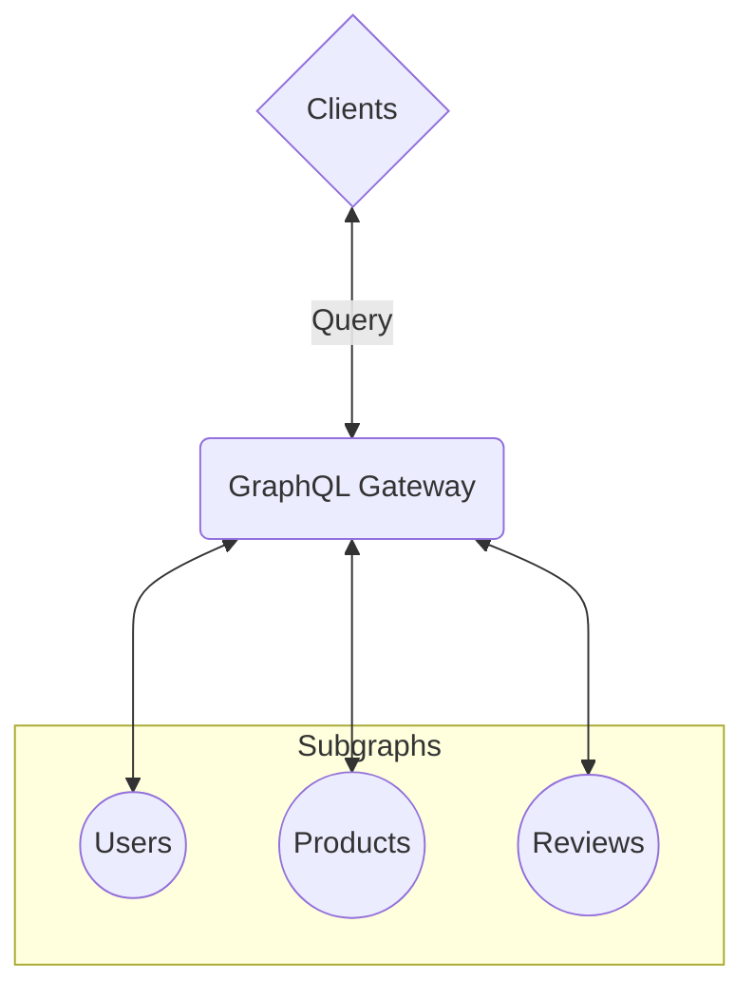

# Spec Agnostic Executor for Federated GraphQL

A Zero-Dependency Approach to Planning & Executing Federated Schemas

<div class="flex flex-items-center gap-sm mt-15">
  
  <div class="flex flex-col">
    <div>Denis Badurina</div>
    <small class="opacity-50">
      Software Architect @ <a href="https://the-guild.dev/">The Guild</a>
    </small>
    <small>
      <grommet-icons-github /> <a href="https://github.com/enisdenjo">@enisdenjo</a>
    </small>
  </div>
</div>

---

# Hi! 👋

I create and solve problems

- I am Denis
- From The Guild, we love OSS and GraphQL. Visit us at [the-guild.dev](https://the-guild.dev/)
- `@enisdenjo` handle _everywhere_

<!--
- Before we start, let me introduce myself
- I am Denis from The Guild. We are the largest open-source vendor in the GraphQL ecosystem
- This is my handle, I use the same one everywhere
-->

---
layout: two-cols-header
---

# What is Federated GraphQL?

Allows multiple services (subgraphs) to work together to present a single, unified GraphQL API

::left::

**Isolation**

Each service manages its own part of the schema.

**API**

Clients query one endpoint resolved across multiple services.

**Relationships**

Services can reference fields and types from other services.

**Coordination**

A GraphQL Gateway compiles and delegates queries to the appropriate services.

::right::



<!--
TODO: convert to bullets

Let's start by defining what federated GraphQL is and why it's important.

Federated GraphQL allows us to break down a large, monolithic API into multiple, smaller services, often referred to as subgraphs. Each service owns its own part of the schema, for example, a user service might manage user profiles, while a product service handles product data. Despite this separation, clients interact with a single GraphQL API.

This means that even though the schema is split across services, the client only sees one unified API. The client doesn't need to worry about which service is responsible for what part of the query. The magic happens behind the scenes, where services can reference each other's types and fields.

To make this happen, we usually have a GraphQL Gateway. This gateway sits in front of all the services and is responsible for compiling the query, breaking it down into smaller requests for each service, and then stitching the results back together.

For example, if a client queries user data about a review on a product, the gateway will create requests and join the 3 subgraphs, combine the response and return the result to the client.

The benefits of this approach are significant. First, it allows us to scale services independently, which is crucial for large-scale systems. Each team can develop and deploy their service autonomously, and domain-driven design fits naturally within this structure because each service is only responsible for its own specific domain.

So, in essence, Federated GraphQL gives us all the power of distributed systems with the simplicity of a single, unified GraphQL interface.
-->

---
layout: cover
---

# The two leading specifications

Apollo Federation Spec and GraphQL Composite Schema Spec

<!--
TODO: brief intro about the two
-->

---

# Apollo Federation Specification

Split a GraphQL schema into subgraphs that collaborate to resolve a unified API

## Key Features

- Isolation

**Federated Query Plan**

The Apollo Gateway automatically generates a query plan that splits queries across the subgraphs, optimizing data retrieval and minimizing service-to-service calls.

**Service Autonomy**

Each subgraph can evolve independently, and schema changes in one service won’t break the overall API, as long as the directives are correctly applied.

**Cross-Service Collaboration**

Through these directives, services can reference and rely on data from other services, ensuring seamless collaboration while maintaining service boundaries.

---

# GraphQL Composite Schema Specification

Standardized approach to federated schemas, combining multiple source schemas into a single, unified GraphQL schema

## Key Features

- Composable
- Collaborative
- Evolvable
- Explicitness

## Core Components

- Schema Composition
- Distributed Execution <span class="opacity-50">(in progress)</span>

<!--
TODO: convert to bullets

The GraphQL Composite Schema Specification allows us to create a single unified schema by merging multiple source schemas from different services. This unified schema, or composite schema, appears to clients just like any regular GraphQL schema. The complexity of the underlying systems is completely hidden, and clients interact as though they're working with one seamless API.

Now, this specification is built on several key design principles that make it highly adaptable and effective for large-scale systems:

Composable: Instead of building each source schema in isolation and then trying to fit them together later, this approach encourages us to design source schemas as part of a larger system from the start. This way, services can easily reference and extend each other, creating a cohesive schema from the get-go.

Collaborative: It's designed specifically with teamwork in mind. As multiple teams contribute to the overall schema, any potential conflicts or inconsistencies are caught early—before deployment. This ensures smooth collaboration without the risk of one team breaking the entire system.

Evolvable: As our underlying services evolve, this composite schema approach allows us to shift functionality between services while keeping the same API interface for clients. In other words, clients continue to see the same API, even if the backend services change.

Explicitness: One of the core ideas here is to be as clear and explicit as possible. By avoiding ambiguous assumptions and conventions, we reduce the risk of failures as the system grows and becomes more complex.

In practice, the GraphQL Composite Schema Spec is built around two key components:

Schema Composition: This is where the source schemas are merged into a single composite schema. During this process, an intermediary execution schema is created. This schema is annotated with directives to help guide how execution happens behind the scenes.

Distributed Execution: The executor handles the core logic and algorithms for resolving requests made against the composite schema. It coordinates how data is retrieved from the various underlying services, making sure everything runs smoothly across the distributed system.

This spec enables us to build a highly scalable, flexible, and future-proof API that can evolve with our services without disrupting the client experience.
-->

---
layout: cover
---

# Why go Spec Agnostic?

Both for Query Planning and Execution

<!--
- Why would you want to have a spec agnostic query planner and executor?
-->

---

# Why go Spec Agnostic?

<!--
- Both specs share the same idea and the mechanism for fetching data is almost the same
- Going specless allows creating a federated system by understanding primitives
- The `graphql-composite` library has a "blueprint" which is essentially a supergraph defining how the different subgraphs behave and which data they hold
-->

---
layout: cover
---

# `graphql-composite`

Spec agnostic GraphQL composite schema planner and executor

<!--
- Introducing `graphql-composite`
- The spec agnostic GraphQL composite schema planner, executor and explainer
-->

---

# `graphql-composite`

Spec agnostic GraphQL composite schema planner and executor

- Zero-dependency
- Spec agnostic
  - Even specless since you can design your own Blueprint
- Runs in any JavaScript environment
- Stable plans and explanations
- Everything's JSON serialisable, all steps until execution can be cached

<!--
TODO
-->

---

# `graphql-composite`

How Does it Work?

<!--
- Everything starts with a blueprint
  - It defines all interactions and relations of the subgraph to form a unified schema
-->

---
layout: cover
---

# Example

A store with products and its manufacturer information

---
layout: center
---

# `stores` Subgraph

Stores and basic product info

```graphql
type Query {
  store(id: ID!): Store
}

type Store {
  id: ID!
  name: String!
  products: [Product]!
}

type Product {
  id: ID!
}
```

---
layout: center
---

# `products` Subgraph

Products and basic manufacturer information

```graphql
type Query {
  product(id: ID!): Product
}

type Product {
  id: ID!
  name: String!
  price: Float!
  manufacturer: Manufacturer
}

type Manufacturer {
  id: ID!
  products: [Product]!
}
```

---
layout: center
---

# `manufacturers` Subgraph

Only manufacturers information

```graphql
type Query {
  manufacturer(id: ID!): Manufacturer
}

type Manufacturer {
  id: ID!
  name: String!
}
```

---
layout: cover
---

# Assembling the Blueprint

Joining the subgraphs to form a single unified GraphQL API

---

# Assembling the Blueprint

Desired GraphQL Schema

```graphql
type Query {
  store(id: ID!): Store
}

type Store {
  id: ID!
  name: String!
  products: [Product]!
}

type Product {
  id: ID!
  name: String!
  price: Float!
  manufacturer: Manufacturer!
}

type Manufacturer {
  id: ID!
  name: String!
  products: [Product]!
}
```

---

# Assembling the Blueprint

Defining the `Query` type

```ts {*}{maxHeight:'400px'}
const Query = {
  kind: 'object',
  name: 'Query',
  fields: {
    store: {
      name: 'store',
      subgraphs: ['stores'],
      types: {
        stores: 'Store',
      },
      resolvers: {
        stores: {
          subgraph: 'stores',
          kind: 'object',
          type: 'Store',
          ofType: 'Store',
          operation: /* GraphQL */ `
            query ($id: ID!) {
              store(id: $id) {
                ...__export
              }
            }
          `,
          variables: {
            id: {
              kind: 'user',
              name: 'id',
            },
          },
        },
      },
    },
  },
};
```

---

# Assembling the Blueprint

Defining the `Store` type

```ts {*}{maxHeight:'400px'}
const Store = {
  kind: 'object',
  name: 'Store',
  fields: {
    id: {
      name: 'id',
      subgraphs: ['stores'],
      types: {
        stores: 'ID!',
      },
    },
    name: {
      name: 'name',
      subgraphs: ['stores'],
      types: {
        stores: 'String!',
      },
    },
    products: {
      name: 'products',
      subgraphs: ['stores'],
      types: {
        stores: '[Product]!',
      },
    },
  },
};
```

<!--
- (COMING BACK) Notice how we dont no resolvers
-->

---

# Assembling the Blueprint

Defining the `Product` type

```ts {*}{maxHeight:'400px'}
const Product = {
  kind: 'object',
  name: 'Product',
  fields: {
    id: {
      name: 'id',
      subgraphs: ['products', 'stores'],
      types: {
        products: 'ID!',
        stores: 'ID!',
      },
    },
    name: {
      name: 'name',
      subgraphs: ['products'],
      types: {
        products: 'String!',
      },
    },
    price: {
      name: 'price',
      subgraphs: ['products'],
      types: {
        products: 'Float!',
      },
    },
    manufacturer: {
      name: 'manufacturer',
      subgraphs: ['products'],
      types: {
        products: 'Manufacturer',
      },
    },
  },
  resolvers: {
    products: [
      {
        subgraph: 'products',
        kind: 'object',
        type: 'Product',
        ofType: 'Product',
        operation: /* GraphQL */ `
          query ($Product_id: ID!) {
            product(id: $Product_id) {
              ...__export
            }
          }
        `,
        variables: {
          Product_id: {
            kind: 'select',
            name: 'Product_id',
            select: 'id',
          },
        },
      },
    ],
  },
};
```

---

# Assembling the Blueprint

Defining the `Manufacturer` type

```ts {*}{maxHeight:'400px'}
const Manufacturer = {
  kind: 'object',
  name: 'Manufacturer',
  fields: {
    id: {
      name: 'id',
      subgraphs: ['manufacturers', 'products'],
      types: {
        manufacturers: 'ID!',
        products: 'ID!',
      },
    },
    name: {
      name: 'name',
      subgraphs: ['manufacturers'],
      types: {
        manufacturers: 'String!',
      },
    },
    products: {
      name: 'products',
      subgraphs: ['products'],
      types: {
        products: '[Product]!',
      },
    },
  },
  resolvers: {
    manufacturers: [
      {
        subgraph: 'manufacturers',
        kind: 'object',
        type: 'Manufacturer',
        ofType: 'Manufacturer',
        operation: /* GraphQL */ `
          query ($Manufacturer_id: ID!) {
            manufacturer(id: $Manufacturer_id) {
              ...__export
            }
          }
        `,
        variables: {
          Manufacturer_id: {
            kind: 'select',
            name: 'Manufacturer_id',
            select: 'id',
          },
        },
      },
    ],
  },
};
```

---
layout: cover
---

# Assembling the Blueprint

Aaand, we're done! 🎉

---

# Query

Let's assemble a query that touches all of the subgraphs

```graphql
query ($id: ID!) {
  store(id: $id) {
    # store subgraph
    name
    products {
      id
      # products subgraph
      name
      price
      manufacturer {
        # manufacturers subgraph
        name
        products {
          # products subgraph
          name
        }
      }
    }
  }
}
```

---

# Gather Plan

Step #1 - the `stores` subgraph

Fetch the store and the product IDs from the `stores` subgraph

```graphql
query ($id: ID!) {
  store(id: $id) {
    name
    products {
      id
    }
  }
}
```

---

# Gather Plan

Step #2 - the `products` subgraph

For each of the product IDs fetched from the `stores` subgraph, query the `products` subgraph and retrieve the product's name as well as its basic manufacturer information

```graphql
query ($Product_id_from_the_store_products: ID!) {
  product(id: $Product_id_from_the_store_products) {
    name
    price
    manufacturer {
      id
      products {
        name
      }
    }
  }
}
```

---

# Gather Plan

Step #3 - the `manufacturers` subgraph

Finally, for each of the manufacturer IDs fetched from the `products` subgraph, query the `manufacturers` subgraph and retrieve the manufacturer's name

```graphql
query ($Manufacturer_id_from_the_products_manufacturer_ids: ID!) {
  manufacturer(id: $Manufacturer_id_from_the_products_manufacturer_ids) {
    name
  }
}
```

---

# Gather Plan

The complete gather plan looks like this (literally)

```ts {*}{maxHeight: '400px'}
const gatherPlan = {
  query: '<query>',
  operation: {
    name: null,
    type: 'Query',
    resolvers: {
      store: {
        subgraph: 'stores',
        kind: 'object',
        type: 'Store',
        ofType: 'Store',
        operation: /* GraphQL */ `
          query ($id: ID!) {
            store(id: $id) {
              name
              products {
                id
              }
            }
          }
        `,
        variables: {
          id: {
            kind: 'user',
            name: 'id',
          },
        },
        pathToExportData: ['store'],
        exports: [
          {
            kind: 'scalar',
            name: 'name',
          },
          {
            kind: 'object',
            name: 'products',
            selections: [
              {
                kind: 'scalar',
                name: 'id',
              },
            ],
          },
        ],
        includes: {
          products: {
            subgraph: 'products',
            kind: 'object',
            type: 'Product',
            ofType: 'Product',
            operation: /* GraphQL */ `
              query ($Product_id: ID!) {
                product(id: $Product_id) {
                  name
                  price
                  manufacturer {
                    id
                    products {
                      name
                    }
                  }
                }
              }
            `,
            variables: {
              Product_id: {
                kind: 'select',
                name: 'Product_id',
                select: 'id',
              },
            },
            pathToExportData: ['product'],
            exports: [
              {
                kind: 'scalar',
                name: 'name',
              },
              {
                kind: 'scalar',
                name: 'price',
              },
              {
                kind: 'object',
                name: 'manufacturer',
                selections: [
                  {
                    private: true,
                    kind: 'scalar',
                    name: 'id',
                  },
                  {
                    kind: 'object',
                    name: 'products',
                    selections: [
                      {
                        kind: 'scalar',
                        name: 'name',
                      },
                    ],
                  },
                ],
              },
            ],
            includes: {
              manufacturer: {
                subgraph: 'manufacturers',
                kind: 'object',
                type: 'Manufacturer',
                ofType: 'Manufacturer',
                operation: /* GraphQL */ `
                  query ($Manufacturer_id: ID!) {
                    manufacturer(id: $Manufacturer_id) {
                      name
                    }
                  }
                `,
                variables: {
                  Manufacturer_id: {
                    kind: 'select',
                    name: 'Manufacturer_id',
                    select: 'id',
                  },
                },
                pathToExportData: ['manufacturer'],
                exports: [
                  {
                    kind: 'scalar',
                    name: 'name',
                  },
                ],
                includes: {},
              },
            },
          },
        },
      },
    },
  },
};
```

<!--
- The gather plan is serialisable, you can cache it and avoid planning again
- Ideally, you'd store the gather plan alongside your persisted operations
-->

---

# Execution

Now that we have an assembled gather plan, it's just a matter of following the defined steps

The gather plan states:

- Fetch the store and the product IDs from the `stores` subgraph
  - For each of the product IDs fetched from the `stores` subgraph, query the `products` subgraph and retrieve the product's name as well as its basic manufacturer information
    - For each of the manufacturer IDs fetched from the `products` subgraph, query the `manufacturers` subgraph and retrieve the manufacturer's name

so we just do that...

<!--
- The execution is all about following the rules of the gather plan
- Having the plan very explicit, the execution part itself can isolated
  - And modularised so that you have only the executor running on the edge
  - or even implemented in another language to squeeze out max performance
-->

---

# Explain

Execution needs explaining, it contains information such as

- Which subgraphs were contacted
- Which queries and variables were used
- What were the responses
- Where's the fetched data inserted in the final result
- ...and more

<!--
- It is very important for an executor to explain what has happened
  - In as much detail as possible
- Explaining the execution helps debug issues if some subgraphs turn out to be unavailable or if you're unsure about the decisions the gather plan made
-->

---

# Explain

Explaining <Link to="23">the query</Link> contains the following information

- Which subgraphs were contacted
- Which queries and variables were used
- What were the responses
- Where's the fetched data inserted in the final result
- _...and more_

<!--
- It is very important for an executor to explain what has happened
  - In as much detail as possible
- Explaining the execution helps debug issues if some subgraphs turn out to be unavailable or if you're unsure about the decisions the gather plan made
-->

---

# Explain

Full explanation looks like this and is the part of GraphQL's execution result `extensions`

<small class="color-blue-200">ℹ️ it's very long</small>

```ts {*}{maxHeight: '350px'}
const explain = [
  {
    subgraph: 'stores',
    kind: 'object',
    type: 'Store',
    ofType: 'Store',
    operation: /* GraphQL */ `
      query ($id: ID!) {
        store(id: $id) {
          name
          products {
            id
          }
        }
      }
    `,
    variables: {
      id: 'apple-store',
    },
    pathToExportData: ['store'],
    exports: [
      {
        kind: 'scalar',
        name: 'name',
      },
      {
        kind: 'object',
        name: 'products',
        selections: [
          {
            kind: 'scalar',
            name: 'id',
          },
        ],
      },
    ],
    includes: [
      {
        subgraph: 'products',
        kind: 'object',
        type: 'Product',
        ofType: 'Product',
        operation: /* GraphQL */ `
          query ($Product_id: ID!) {
            product(id: $Product_id) {
              name
              price
              manufacturer {
                id
                products {
                  name
                }
              }
            }
          }
        `,
        variables: {
          Product_id: 'iphone',
        },
        pathToExportData: ['product'],
        exports: [
          {
            kind: 'scalar',
            name: 'name',
          },
          {
            kind: 'scalar',
            name: 'price',
          },
          {
            kind: 'object',
            name: 'manufacturer',
            selections: [
              {
                private: true,
                kind: 'scalar',
                name: 'id',
              },
              {
                kind: 'object',
                name: 'products',
                selections: [
                  {
                    kind: 'scalar',
                    name: 'name',
                  },
                ],
              },
            ],
          },
        ],
        includes: [
          {
            subgraph: 'manufacturers',
            kind: 'object',
            type: 'Manufacturer',
            ofType: 'Manufacturer',
            operation: /* GraphQL */ `
              query ($Manufacturer_id: ID!) {
                manufacturer(id: $Manufacturer_id) {
                  name
                }
              }
            `,
            variables: {
              Manufacturer_id: 'apple',
            },
            pathToExportData: ['manufacturer'],
            exports: [
              {
                kind: 'scalar',
                name: 'name',
              },
            ],
            includes: [],
            data: {
              manufacturer: {
                name: 'Apple',
              },
            },
            pathInData: ['store', 'products', 0, 'manufacturer'],
          },
        ],
        data: {
          product: {
            name: 'Apple iPhone',
            price: 20,
            manufacturer: {
              id: 'apple',
              products: [
                {
                  name: 'Apple iPhone',
                },
                {
                  name: 'iPad',
                },
              ],
            },
          },
        },
        pathInData: ['store', 'products', 0],
      },
      {
        subgraph: 'products',
        kind: 'object',
        type: 'Product',
        ofType: 'Product',
        operation: /* GraphQL */ `
          query ($Product_id: ID!) {
            product(id: $Product_id) {
              name
              price
              manufacturer {
                id
                products {
                  name
                }
              }
            }
          }
        `,
        variables: {
          Product_id: 'ipad',
        },
        pathToExportData: ['product'],
        exports: [
          {
            kind: 'scalar',
            name: 'name',
          },
          {
            kind: 'scalar',
            name: 'price',
          },
          {
            kind: 'object',
            name: 'manufacturer',
            selections: [
              {
                private: true,
                kind: 'scalar',
                name: 'id',
              },
              {
                kind: 'object',
                name: 'products',
                selections: [
                  {
                    kind: 'scalar',
                    name: 'name',
                  },
                ],
              },
            ],
          },
        ],
        includes: [
          {
            subgraph: 'manufacturers',
            kind: 'object',
            type: 'Manufacturer',
            ofType: 'Manufacturer',
            operation: /* GraphQL */ `
              query ($Manufacturer_id: ID!) {
                manufacturer(id: $Manufacturer_id) {
                  name
                }
              }
            `,
            variables: {
              Manufacturer_id: 'apple',
            },
            pathToExportData: ['manufacturer'],
            exports: [
              {
                kind: 'scalar',
                name: 'name',
              },
            ],
            includes: [],
            data: {
              manufacturer: {
                name: 'Apple',
              },
            },
            pathInData: ['store', 'products', 1, 'manufacturer'],
          },
        ],
        data: {
          product: {
            name: 'iPad',
            price: 25,
            manufacturer: {
              id: 'apple',
              products: [
                {
                  name: 'Apple iPhone',
                },
                {
                  name: 'iPad',
                },
              ],
            },
          },
        },
        pathInData: ['store', 'products', 1],
      },
    ],
    data: {
      store: {
        name: 'Apple Store',
        products: [
          {
            id: 'iphone',
          },
          {
            id: 'ipad',
          },
        ],
      },
    },
    pathInData: ['store'],
  },
][
  {
    subgraph: 'stores',
    kind: 'object',
    type: 'Store',
    ofType: 'Store',
    operation: /* GraphQL */ `
      query ($id: ID!) {
        store(id: $id) {
          name
          products {
            id
          }
        }
      }
    `,
    variables: {
      id: 'apple-store',
    },
    pathToExportData: ['store'],
    exports: [
      {
        kind: 'scalar',
        name: 'name',
      },
      {
        kind: 'object',
        name: 'products',
        selections: [
          {
            kind: 'scalar',
            name: 'id',
          },
        ],
      },
    ],
    includes: [
      {
        subgraph: 'products',
        kind: 'object',
        type: 'Product',
        ofType: 'Product',
        operation: /* GraphQL */ `
          query ($Product_id: ID!) {
            product(id: $Product_id) {
              name
              price
              manufacturer {
                id
                products {
                  name
                }
              }
            }
          }
        `,
        variables: {
          Product_id: 'iphone',
        },
        pathToExportData: ['product'],
        exports: [
          {
            kind: 'scalar',
            name: 'name',
          },
          {
            kind: 'scalar',
            name: 'price',
          },
          {
            kind: 'object',
            name: 'manufacturer',
            selections: [
              {
                private: true,
                kind: 'scalar',
                name: 'id',
              },
              {
                kind: 'object',
                name: 'products',
                selections: [
                  {
                    kind: 'scalar',
                    name: 'name',
                  },
                ],
              },
            ],
          },
        ],
        includes: [
          {
            subgraph: 'manufacturers',
            kind: 'object',
            type: 'Manufacturer',
            ofType: 'Manufacturer',
            operation: /* GraphQL */ `
              query ($Manufacturer_id: ID!) {
                manufacturer(id: $Manufacturer_id) {
                  name
                }
              }
            `,
            variables: {
              Manufacturer_id: 'apple',
            },
            pathToExportData: ['manufacturer'],
            exports: [
              {
                kind: 'scalar',
                name: 'name',
              },
            ],
            includes: [],
            data: {
              manufacturer: {
                name: 'Apple',
              },
            },
            pathInData: ['store', 'products', 0, 'manufacturer'],
          },
        ],
        data: {
          product: {
            name: 'Apple iPhone',
            price: 20,
            manufacturer: {
              id: 'apple',
              products: [
                {
                  name: 'Apple iPhone',
                },
                {
                  name: 'iPad',
                },
              ],
            },
          },
        },
        pathInData: ['store', 'products', 0],
      },
      {
        subgraph: 'products',
        kind: 'object',
        type: 'Product',
        ofType: 'Product',
        operation: /* GraphQL */ `
          query ($Product_id: ID!) {
            product(id: $Product_id) {
              name
              price
              manufacturer {
                id
                products {
                  name
                }
              }
            }
          }
        `,
        variables: {
          Product_id: 'ipad',
        },
        pathToExportData: ['product'],
        exports: [
          {
            kind: 'scalar',
            name: 'name',
          },
          {
            kind: 'scalar',
            name: 'price',
          },
          {
            kind: 'object',
            name: 'manufacturer',
            selections: [
              {
                private: true,
                kind: 'scalar',
                name: 'id',
              },
              {
                kind: 'object',
                name: 'products',
                selections: [
                  {
                    kind: 'scalar',
                    name: 'name',
                  },
                ],
              },
            ],
          },
        ],
        includes: [
          {
            subgraph: 'manufacturers',
            kind: 'object',
            type: 'Manufacturer',
            ofType: 'Manufacturer',
            operation: /* GraphQL */ `
              query ($Manufacturer_id: ID!) {
                manufacturer(id: $Manufacturer_id) {
                  name
                }
              }
            `,
            variables: {
              Manufacturer_id: 'apple',
            },
            pathToExportData: ['manufacturer'],
            exports: [
              {
                kind: 'scalar',
                name: 'name',
              },
            ],
            includes: [],
            data: {
              manufacturer: {
                name: 'Apple',
              },
            },
            pathInData: ['store', 'products', 1, 'manufacturer'],
          },
        ],
        data: {
          product: {
            name: 'iPad',
            price: 25,
            manufacturer: {
              id: 'apple',
              products: [
                {
                  name: 'Apple iPhone',
                },
                {
                  name: 'iPad',
                },
              ],
            },
          },
        },
        pathInData: ['store', 'products', 1],
      },
    ],
    data: {
      store: {
        name: 'Apple Store',
        products: [
          {
            id: 'iphone',
          },
          {
            id: 'ipad',
          },
        ],
      },
    },
    pathInData: ['store'],
  }
];
```

---
layout: cover
---

# Let's see the tests passing

In `graphql-composite`'s test suite

[🔗 Open](https://github.com/enisdenjo/graphql-composite/tree/graphql-conf-2024/tests/fixtures/graphql-conf-2024-example)

---
layout: two-cols-header
---

# Very WIP

`graphql-composite` is in active development, use with care!

::left::

A number of features are missing and yet to be developed. The open issues can be found [on the repo](https://github.com/enisdenjo/graphql-composite/issues), some key takeaways are:

- Batching
- Introspection
- Interfaces implementing other interfaces
- `@defer` directive
- Subscriptions
- Apollo Federation support
  - `@requires` and `@provides`
- _...and more_

::right::


<!--
- I must put emphasis on the fact that the library is still under active construction
- It is missing many features
-->
