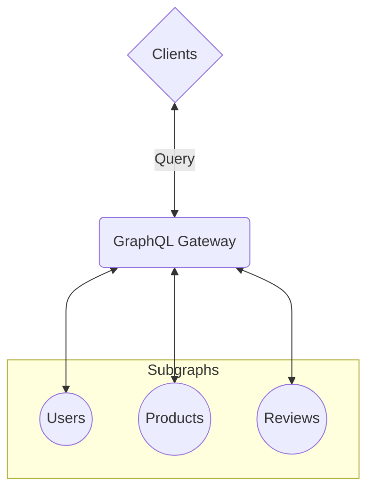

# Spec Agnostic Executor for Federated GraphQL

A Zero-Dependency Approach to Planning & Executing Federated Schemas

  
  

    
Denis Badurina

    <small class="opacity-50">
      Software Architect @ <a href="https://the-guild.dev/">The Guild</a>
    </small>
    <small>
      <grommet-icons-github /> <a href="https://github.com/enisdenjo">@enisdenjo</a>
    </small>
  

---

# Hi! 👋

I create and solve problems

- I am Denis
- From The Guild, we love OSS and GraphQL. Visit us at [the-guild.dev](https://the-guild.dev/)
- `@enisdenjo` handle _everywhere_

<!--
- Before we start, let me introduce myself
- I am Denis from The Guild. We are the largest open-source vendor in the GraphQL ecosystem
- This is my handle, I use the same one everywhere
-->

---
layout: two-cols-header
---

# What is Federated GraphQL?

Allows multiple services (subgraphs) to work together to present a single, unified GraphQL API

::left::

**Isolation**

Each service manages its own part of the schema.

**API**

Clients query one endpoint resolved across multiple services.

**Relationships**

Services can reference fields and types from other services.

**Coordination**

A GraphQL Gateway compiles and delegates queries to the appropriate services.

::right::

<!--
TODO: convert to bullets

Let's start by defining what federated GraphQL is and why it's important.

Federated GraphQL allows us to break down a large, monolithic API into multiple, smaller services, often referred to as subgraphs. Each service owns its own part of the schema, for example, a user service might manage user profiles, while a product service handles product data. Despite this separation, clients interact with a single GraphQL API.

This means that even though the schema is split across services, the client only sees one unified API. The client doesn't need to worry about which service is responsible for what part of the query. The magic happens behind the scenes, where services can reference each other's types and fields.

To make this happen, we usually have a GraphQL Gateway. This gateway sits in front of all the services and is responsible for compiling the query, breaking it down into smaller requests for each service, and then stitching the results back together.

For example, if a client queries user data about a review on a product, the gateway will create requests and join the 3 subgraphs, combine the response and return the result to the client.

The benefits of this approach are significant. First, it allows us to scale services independently, which is crucial for large-scale systems. Each team can develop and deploy their service autonomously, and domain-driven design fits naturally within this structure because each service is only responsible for its own specific domain.

So, in essence, Federated GraphQL gives us all the power of distributed systems with the simplicity of a single, unified GraphQL interface.
-->
