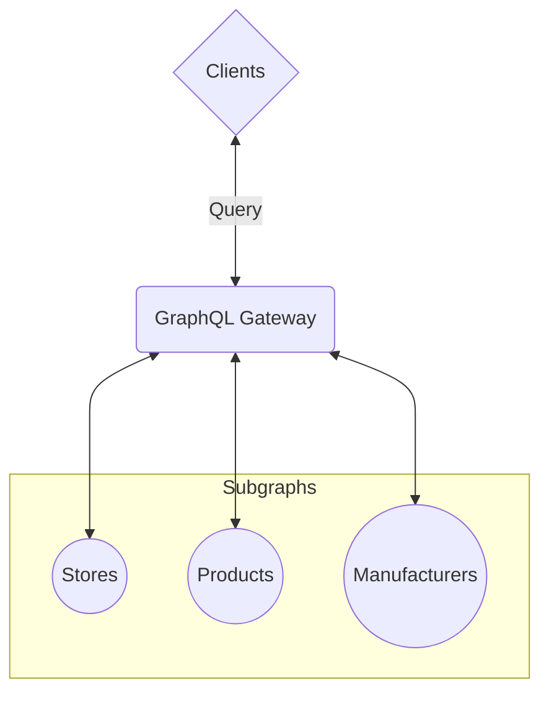

# Spec Agnostic Executor for Federated GraphQL

A Zero-Dependency Approach to Planning & Executing Federated Schemas

<div class="flex flex-items-center gap-sm mt-15">
  
  <div class="flex flex-col">
    <div>Denis Badurina</div>
    <small class="opacity-50">
      Software Architect @ <a href="https://the-guild.dev/">The Guild</a>
    </small>
    <small>
      <grommet-icons-github /> <a href="https://github.com/enisdenjo">@enisdenjo</a>
    </small>
  </div>
</div>

<!--
- Hello everyone!
- I am super excited to be a part of the second GraphQL conference
- I hope you all are having fun and enjoying the coffer
-->

---

# Hi! 👋

I create and solve problems

- I am Denis
- GraphQL TSC member
- From The Guild, we love OSS and GraphQL. Visit us at [the-guild.dev](https://the-guild.dev/)
- `@enisdenjo` handle _everywhere_

<!--
- Before we start, let me introduce myself
- I am Denis from The Guild. And am also a member of the GraphQL TSC
- So feel free to chase me down and smuther me with any GraphQL related questions, I'm excited to meet everbody
-->

---
layout: two-cols-header
---

# What is Federated GraphQL?

Allows multiple services (subgraphs) to work together to present a single, unified GraphQL API

::left::

**Isolation**

Each service manages its own part of the schema.

**API**

Clients query one endpoint resolved across multiple services.

**Relationships**

Services can reference fields and types from other services.

**Coordination**

A GraphQL Gateway compiles and delegates queries to the appropriate services.

::right::



<!--
- Let's jump right to it!
- What is federated GraphQL and why is it important?
- Federated GraphQL allows us to break down a large, monolithic API into multiple, smaller services (called subgraphs).
- Each service owns its own part of the schema
  - For example, a user service might manage user profiles, while a product service handles product data.
- Despite this separation, clients interact with a single GraphQL API.
- This means that even though the schema is split across services, the client only sees one unified API.
  - They don't need to worry about which service is responsible for what. All of the magic happens behind the scenes, where services can reference each other's types and fields.

- GraphQL Gateway is what does most of the heavy lifting.
- This gateway sits in front of all the services and is responsible for compiling the query, breaking it down into smaller requests for each subgraph, and then stitching the results back together.

- The benefits of this approach are significant.
  - First, it allows us to scale services independently, which is crucial for large-scale systems.
  - Each team can develop and deploy their service autonomously
  - And domain-driven design fits naturally within this structure because each service is only responsible for its own specific domain.

- So, in essence, Federated GraphQL gives us all the power of distributed systems with the simplicity of a single, unified GraphQL interface.
-->

---
layout: cover
---

# The Two Leading Federation Specifications

Apollo Federation Spec and GraphQL Composite Schema Spec

<!--
- There are two leading federation specifications that standardise how a federated GraphQL system works
- The Apollo Federation spec
- And the upcoming GraphQL Composite Schema spec
-->

---

# Apollo Federation Specification

Split a GraphQL schema into subgraphs that collaborate to resolve a unified API

## Key Features

- Subgraph-Based Schema Composition
- Federation Directives
- Subgraph Independence

## Core Components

- Schema Composition
- Distributed Execution

<!--
- Let's start by briefly talking about Apollo Federation
- Apollo Federation allows the creation of subgraphs, where each service manages its own part of the schema.
  - These subgraphs are then composed to form a unified API, providing clear boundaries for each service.
- Apollo Federation uses a set of key directives like @key, @extends, @provides, and @requires to manage how types and fields are shared or extended across services.
  - These directives make it possible to resolve cross-service references and establish relationships between entities.
- Subgraphs can evolve independently.
  - Each service is responsible for its own schema and changes, such as adding new fields or types, without affecting the other services, as long as directives and relationships rules are respected.
-->

---

# GraphQL Composite Schema Specification

Standardized approach combining multiple source schemas into a single, unified GraphQL schema

## Key Features

- Composable
- Collaborative
- Evolvable
- Explicitness

## Core Components

- Schema Composition <span class="opacity-50">(coming soon)</span>
- Distributed Execution <span class="opacity-50">(coming soon)</span>

<!--
- The other player in the field is the GraphQL Composite Schema Specification
- It's the official work backed by the GraphQL Foundation
- The GraphQL Composite Schema Specification allows us to create a single unified schema by merging multiple source schemas from different services.
- This unified schema, or composite schema, appears to clients just like any regular GraphQL schema.
- Now, this specification is built on several key design principles that make it highly adaptable and effective for large-scale systems:

- Composable:
  - Instead of building each source schema in isolation and then trying to fit them together later, this approach encourages us to design source schemas as part of a larger system from the start.
  - Services can therefore easily reference and extend each other, creating a cohesive schema from the get-go.
- Collaborative:
  - It's designed specifically with teamwork in mind.
  - As multiple teams contribute to the overall schema, any potential conflicts or inconsistencies are caught early—before deployment.
  - This ensures smooth collaboration without the risk of one team breaking the entire system.
- Evolvable:
  - As our underlying services evolve, this composite schema approach allows us to shift functionality between services while keeping the same API interface for clients.
  - In other words, clients continue to see the same API, even if the backend services change.
- Explicitness:
  - One of the core ideas here is to be as clear and explicit as possible.
  - By avoiding ambiguous assumptions and conventions, we reduce the risk of failures as the system grows and becomes more complex.

In practice, the GraphQL Composite Schema Spec is built around two key components, just like Apollo Federation:

- Schema Composition:
  - This is where the source schemas are merged into a single composite schema.

- Distributed Execution:
  - The executor handles the core logic and algorithms for resolving requests made against the composite schema.
  - It coordinates how data is retrieved from the various underlying services, making sure everything runs smoothly across the distributed system.

This spec enables us to build a highly scalable, flexible, and future-proof API that can evolve with our services without disrupting the client experience.
-->

---
layout: cover
---

# How Does a Query Planner and Executor work?

Can it be spec agnostic?

<!--
- Now that we've been introduced to the two federated GraphQL specs
- Let's talk about the actual brains of the system - the query planner and executor
- How do they actually work? Can we have an executor that can universally cover all possible federation specs?
- And finally, is a spec agnostic query planner and executor possible?
  - We'll see...
-->

---

# How Does a Query Planner and Executor work?

Boils down to 4 steps

1. 🤔 Query Planning
1. 🏃 Subquery Execution
1. ⛙ Result Merging
1. ⏩ Optimizations

<!--
- The workings of the QP and execution boil down to 4 steps

- Step 1: Query Planning
  - The QP receives a query and breaks it down into subqueries based on the schema owned by each subgraph
  - It then identifies which subgraphs need to resolve specific parts of the query by looking at type ownership and relationships
  - Finally, a QP is generated - defining the order and dependencies for fetching data from each subgraph

- Step 2: Subquery Execution
  - Each subquery is dispatched to the relevant subgraph, where it is resolved independently
  - The executor manages the parallel and sequential execution of these subqueries, keeping the data dependencies between subgraphs in mind

- Step 3: Result Merging
  - Once all subqueries are resolved, the gateway merges the responses based on the query plan
  - The final result is stitched together and sent back to the client as a unified response

- Step 4: Optimization
  - The executor optimizes for performance by reducing service-to-service calls, executing non-dependent subqueries in parallel, and fetching data in batches where possible.

- Both specs share the same idea and the mechanism for fetching data is almost the same
- So creating a specless query planner and executor might just be possible...
-->

---
layout: cover
---

# `graphql-composite`

Spec agnostic GraphQL composite schema planner and executor

[github.com/enisdenjo/graphql-composite](https://github.com/enisdenjo/graphql-composite)

<span class="color-yellow">🚧 Very WIP</span>


<!--
- Introducing `graphql-composite`
- The spec agnostic GraphQL composite schema planner, executor and explainer

- Heads up, the library is being actively developed and is NOT published anywhere as of right now
- You can visit the respository though, dig through the tests and fixtures to get an idea of its inner workings
-->

---

# `graphql-composite`

What makes it interesting and different?

- Zero-dependency
- Spec agnostic
  - Even specless since you can design your own "Blueprint"
- Runs in _any_ JavaScript environment
- Stable plans and explanations
- No GraphQL.js in execution
- Everything's JSON serialisable, all steps until execution can be cached
- Test Driven Development thanks to [The Guild's Apollo Federation Audit](https://federation-gateway-compatibility.pages.dev/)

<!--
- The work on the library started only to learn and get in-depth knowledge about federated GraphQL
  - Why are query planners and executors so complicated, how do they works and what decisions it has to make in various scenarious
- And I can tell you something - federation is hard, especially federated interfaces and unions!

- Being zero-dep means you don’t need to worry about external packages or libraries. It’s lightweight, highly portable, and easier to integrate into any environment. Oh and, also aims to be very secure!
- The library is not tied to any specific GraphQL federation spec, including Apollo Federation. It aims to support all existing federated specifications.
  - In fact, you can design your own "blueprint" (I'll explain what a "blueprint" is later) on top of existing non-federated GraphQL sources for query planning and execution, making it highly adaptable and future-proof
- The planner produces stable, predictable execution plans that come with detailed execution explanations. This transparency makes it easier to debug, optimize, and understand how queries are resolved and how the final result is assembled.
- All steps leading up to execution are JSON serializable, which means they can be cached at any point in the planning process.
  - This allows for efficient reuse of query plans and significantly improves performance by skipping redundant planning stages.
  - Combining the serialisibility with persisted operations, you can get a very performant and highly secure GraphQL API.
    - Make sure to attend Benjies talk about "Techniques to Protect Your GraphQL API" tomorrow to learn more about persisted operations and security practices

- Finally, the library's been developed using Test-Driven Development, leveraging The Guild's Apollo Federation Audit to ensure consistent and reliable progress. Giving confidence in its stability and correctness from the very beginning.
  - Of course, it does not yet pass many of the tests - but we're getting there!
-->

---

# `graphql-composite`

How does it work? A high-level overview

1. Parse a GraphQL composite schema to a <u>"Blueprint"</u><br>
   _or_ create the <u>"Blueprint"</u> manually
1. Create a <u>"Gather Plan"</u> using the <u>"Blueprint"</u> and a given GraphQL query
1. Execute a query using the <u>"Gather Plan"</u>

Execution will create a ready-to-use GraphQL response and an "ExecutionExplain" with the steps leading to the result

<!--
- Lets go over a high-level overview of how graphql-composite works
- The first step is to create a so called "blueprint".
  - It's sort of what supergraph is in Apollo Federation
  - It contains the relationship information of the subgraphs and how they form
  - At the moment, "blueprints" are created manually
    - But in the future, graphql-composite will be able to translate Apollo Federation supergraphs and GraphQL composite schemas to native "blueprints"
- After that, a "gather plan" is created for an incoming GraphQL query
  - The "gather plan" is the query plan - explaninig what and how to fetch from where
  - And of course, how to assemble the results
- Final step is executing that "gather plan"
-->

---
layout: cover
---

# Example

A store with products and its manufacturer information

<!--
- We understand things best through practical implications, so lets go through one
- Let's say we're building a federated system with 3 subgraphs:
-->

---
layout: center
---

# `stores` Subgraph

Stores and basic product info

```graphql
type Query {
  store(id: ID!): Store
}

type Store {
  id: ID!
  name: String!
  products: [Product]!
}

type Product {
  id: ID!
}
```

<!--
- A `stores` subgraph containing information about the stock and product identifiers
-->

---
layout: center
---

# `products` Subgraph

Products and basic manufacturer information

```graphql
type Query {
  product(id: ID!): Product
}

type Product {
  id: ID!
  name: String!
  price: Float!
  manufacturer: Manufacturer!
}

type Manufacturer {
  id: ID!
  products: [Product]!
}
```

<!--
- A `products` subgraph containing detailed product information and manufacturer identifiers
-->

---
layout: center
---

# `manufacturers` Subgraph

Only manufacturers information

```graphql
type Query {
  manufacturer(id: ID!): Manufacturer
}

type Manufacturer {
  id: ID!
  name: String!
}
```

<!--
- And a `manufacturers` subgraph containing only details about the manufacturers
-->

---
layout: cover
---

# Assembling the Blueprint

Joining the subgraphs to form a single unified GraphQL API

<!--
- Notice how each of the subgraphs are just regular GraphQL endpoints without any federation related trickery
  - No special directives, no special fields
  - Think of the subgraphs as regular GraphQL endpoints which are not meant to be federated
- Our task now is to assemble a blueprint which will communicate the subgraph contents and their relationships
-->

---
layout: two-cols-header
---

# Assembling the Blueprint

Desired GraphQL schema

::left::

<div class="mr-1">

```graphql
type Query {
  store(id: ID!): Store
}

type Store {
  id: ID!
  name: String!
  products: [Product]!
}

type Product {
  id: ID!
  name: String!
  price: Float!
  manufacturer: Manufacturer!
}

type Manufacturer {
  id: ID!
  name: String!
  products: [Product]!
}
```

</div>

<!--
- This is what we want, this is the resulting schema we would end up exposing to the user
- So lets get started:
-->

---
layout: two-cols-header
---

# Assembling the Blueprint

Defining the `Query` type

::left::

<div class="mr-1">

```graphql {1-3}
type Query {
  store(id: ID!): Store
}

type Store {
  id: ID!
  name: String!
  products: [Product]!
}

type Product {
  id: ID!
  name: String!
  price: Float!
  manufacturer: Manufacturer!
}

type Manufacturer {
  id: ID!
  name: String!
  products: [Product]!
}
```

</div>

::right::

<div class="ml-1">

```ts {*}{maxHeight:'412px'}
const Query = {
  kind: 'object',
  name: 'Query',
  fields: {
    store: {
      name: 'store',
      subgraphs: ['stores'],
      types: {
        stores: 'Store',
      },
      resolvers: {
        stores: {
          subgraph: 'stores',
          kind: 'object',
          type: 'Store',
          ofType: 'Store',
          operation: /* GraphQL */ `
            query ($id: ID!) {
              store(id: $id) {
                ...__export
              }
            }
          `,
          variables: {
            id: {
              kind: 'user',
              name: 'id',
            },
          },
        },
      },
    },
  },
};
```

</div>

<!--
- The blueprint is very similar to the GraphQL SDL
  - You define types and fields
  - But in addition, you need to define the availability across subgraphs
- Like with the GraphQL SDL, you start by defining the Query type
-->

---
layout: two-cols-header
---

# Assembling the Blueprint

Defining the `Store` type

::left::

<div class="mr-1">

```graphql {5-9}
type Query {
  store(id: ID!): Store
}

type Store {
  id: ID!
  name: String!
  products: [Product]!
}

type Product {
  id: ID!
  name: String!
  price: Float!
  manufacturer: Manufacturer!
}

type Manufacturer {
  id: ID!
  name: String!
  products: [Product]!
}
```

</div>

::right::

<div class="ml-1">

```ts {*}{maxHeight:'412px'}
const Store = {
  kind: 'object',
  name: 'Store',
  fields: {
    id: {
      name: 'id',
      subgraphs: ['stores'],
      types: {
        stores: 'ID!',
      },
    },
    name: {
      name: 'name',
      subgraphs: ['stores'],
      types: {
        stores: 'String!',
      },
    },
    products: {
      name: 'products',
      subgraphs: ['stores'],
      types: {
        stores: '[Product]!',
      },
    },
  },
};
```

</div>

---
layout: two-cols-header
---

# Assembling the Blueprint

Defining the `Product` type

::left::

<div class="mr-1">

```graphql {11-16}
type Query {
  store(id: ID!): Store
}

type Store {
  id: ID!
  name: String!
  products: [Product]!
}

type Product {
  id: ID!
  name: String!
  price: Float!
  manufacturer: Manufacturer!
}

type Manufacturer {
  id: ID!
  name: String!
  products: [Product]!
}
```

</div>

::right::

<div class="ml-1">

```ts {*}{maxHeight:'412px'}
const Product = {
  kind: 'object',
  name: 'Product',
  fields: {
    id: {
      name: 'id',
      subgraphs: ['products', 'stores'],
      types: {
        products: 'ID!',
        stores: 'ID!',
      },
    },
    name: {
      name: 'name',
      subgraphs: ['products'],
      types: {
        products: 'String!',
      },
    },
    price: {
      name: 'price',
      subgraphs: ['products'],
      types: {
        products: 'Float!',
      },
    },
    manufacturer: {
      name: 'manufacturer',
      subgraphs: ['products'],
      types: {
        products: 'Manufacturer',
      },
    },
  },
  resolvers: {
    products: [
      {
        subgraph: 'products',
        kind: 'object',
        type: 'Product',
        ofType: 'Product',
        operation: /* GraphQL */ `
          query ($Product_id: ID!) {
            product(id: $Product_id) {
              ...__export
            }
          }
        `,
        variables: {
          Product_id: {
            kind: 'select',
            name: 'Product_id',
            select: 'id',
          },
        },
      },
    ],
  },
};
```

</div>

---
layout: two-cols-header
---

# Assembling the Blueprint

Defining the `Manufacturer` type

::left::

<div class="mr-1">

```graphql {18-22}
type Query {
  store(id: ID!): Store
}

type Store {
  id: ID!
  name: String!
  products: [Product]!
}

type Product {
  id: ID!
  name: String!
  price: Float!
  manufacturer: Manufacturer!
}

type Manufacturer {
  id: ID!
  name: String!
  products: [Product]!
}
```

</div>

::right::

<div class="ml-1">

```ts {*}{maxHeight:'412px'}
const Manufacturer = {
  kind: 'object',
  name: 'Manufacturer',
  fields: {
    id: {
      name: 'id',
      subgraphs: ['manufacturers', 'products'],
      types: {
        manufacturers: 'ID!',
        products: 'ID!',
      },
    },
    name: {
      name: 'name',
      subgraphs: ['manufacturers'],
      types: {
        manufacturers: 'String!',
      },
    },
    products: {
      name: 'products',
      subgraphs: ['products'],
      types: {
        products: '[Product]!',
      },
    },
  },
  resolvers: {
    manufacturers: [
      {
        subgraph: 'manufacturers',
        kind: 'object',
        type: 'Manufacturer',
        ofType: 'Manufacturer',
        operation: /* GraphQL */ `
          query ($Manufacturer_id: ID!) {
            manufacturer(id: $Manufacturer_id) {
              ...__export
            }
          }
        `,
        variables: {
          Manufacturer_id: {
            kind: 'select',
            name: 'Manufacturer_id',
            select: 'id',
          },
        },
      },
    ],
  },
};
```

</div>

---
layout: two-cols-header
---

# Assembling the Blueprint

Aaand, we're done! 🎉

::left::

[🔗 github.com/enisdenjo/graphql-composite/[...]/blueprint.ts](https://github.com/enisdenjo/graphql-composite/blob/graphql-conf-2024/tests/fixtures/graphql-conf-2024-example/blueprint.ts)


::right::

```ts {*}{maxHeight: '400px'}
const blueprint = {
  schema: '<schema>',
  types: {
    Query: {
      kind: 'object',
      name: 'Query',
      fields: {
        store: {
          name: 'store',
          subgraphs: ['stores'],
          types: {
            stores: 'Store',
          },
          resolvers: {
            stores: {
              subgraph: 'stores',
              kind: 'object',
              type: 'Store',
              ofType: 'Store',
              operation: /* GraphQL */ `
                query ($id: ID!) {
                  store(id: $id) {
                    ...__export
                  }
                }
              `,
              variables: {
                id: {
                  kind: 'user',
                  name: 'id',
                },
              },
            },
          },
        },
      },
    },
    Store: {
      kind: 'object',
      name: 'Store',
      fields: {
        id: {
          name: 'id',
          subgraphs: ['stores'],
          types: {
            stores: 'ID!',
          },
        },
        name: {
          name: 'name',
          subgraphs: ['stores'],
          types: {
            stores: 'String!',
          },
        },
        products: {
          name: 'products',
          subgraphs: ['stores'],
          types: {
            stores: '[Product]!',
          },
        },
      },
    },
    Product: {
      kind: 'object',
      name: 'Product',
      fields: {
        id: {
          name: 'id',
          subgraphs: ['products', 'stores'],
          types: {
            products: 'ID!',
            stores: 'ID!',
          },
        },
        name: {
          name: 'name',
          subgraphs: ['products'],
          types: {
            products: 'String!',
          },
        },
        price: {
          name: 'price',
          subgraphs: ['products'],
          types: {
            products: 'Float!',
          },
        },
        manufacturer: {
          name: 'manufacturer',
          subgraphs: ['products'],
          types: {
            products: 'Manufacturer',
          },
        },
      },
      resolvers: {
        products: [
          {
            subgraph: 'products',
            kind: 'object',
            type: 'Product',
            ofType: 'Product',
            operation: /* GraphQL */ `
              query ($Product_id: ID!) {
                product(id: $Product_id) {
                  ...__export
                }
              }
            `,
            variables: {
              Product_id: {
                kind: 'select',
                name: 'Product_id',
                select: 'id',
              },
            },
          },
        ],
      },
    },
    Manufacturer: {
      kind: 'object',
      name: 'Manufacturer',
      fields: {
        id: {
          name: 'id',
          subgraphs: ['manufacturers', 'products'],
          types: {
            manufacturers: 'ID!',
            products: 'ID!',
          },
        },
        name: {
          name: 'name',
          subgraphs: ['manufacturers'],
          types: {
            manufacturers: 'String!',
          },
        },
        products: {
          name: 'products',
          subgraphs: ['products'],
          types: {
            products: '[Product]!',
          },
        },
      },
      resolvers: {
        manufacturers: [
          {
            subgraph: 'manufacturers',
            kind: 'object',
            type: 'Manufacturer',
            ofType: 'Manufacturer',
            operation: /* GraphQL */ `
              query ($Manufacturer_id: ID!) {
                manufacturer(id: $Manufacturer_id) {
                  ...__export
                }
              }
            `,
            variables: {
              Manufacturer_id: {
                kind: 'select',
                name: 'Manufacturer_id',
                select: 'id',
              },
            },
          },
        ],
      },
    },
  },
};
```

<!--
- Easy as that, the blueprint is ready!
- It is basically a big object containing all of the blueprint parts we went through
- For anyone curious, scan the QR code to see the actual blueprint!
-->

---
layout: two-cols-header
---

# Query

Let's execute a query that touches all of the subgraphs

The following query is deliberately showing the relations of subgraphs

::left::

<div class="mr-1">

```graphql
query ($id: ID!) {
  store(id: $id) {
    name
    products {
      id
      name
      price
      manufacturer {
        name
        products {
          name
        }
      }
    }
  }
}
```

</div>

<!--
- Okay now, having build the blueprint - we're ready to execute queries!
- Let's take this example here, a single query that reaches all of the subgraphs and lets break it down to understand better what's happening underneath the hood
-->

---
layout: two-cols-header
---

# Gather Plan

Step #1 - the `stores` subgraph

Fetch the store and the product IDs from the `stores` subgraph

::left::

<div class="mr-1">

```graphql {1-5,14-16}
query ($id: ID!) {
  store(id: $id) {
    name
    products {
      id
      name
      price
      manufacturer {
        name
        products {
          name
        }
      }
    }
  }
}
```

</div>

::right::

<div class="ml-1">

```graphql
query ($id: ID!) {
  store(id: $id) {
    name
    products {
      id
    }
  }
}
```

</div>

---
layout: two-cols-header
---

# Gather Plan

Step #2 - the `products` subgraph

For each of the product IDs fetched from the `stores` subgraph, query the `products` subgraph and retrieve the product's name as well as its basic manufacturer information

::left::

<div class="mr-1">

```graphql {5-8,10-13}
query ($id: ID!) {
  store(id: $id) {
    name
    products {
      id # $Product_id
      name
      price
      manufacturer {
        name
        products {
          name
        }
      }
    }
  }
}
```

</div>

::right::

<div class="ml-1">

```graphql
query ($Product_id: ID!) {
  product(id: $Product_id) {
    name
    price
    manufacturer {
      id # (private)
      products {
        name
      }
    }
  }
}
```

</div>

---
layout: two-cols-header
---

# Gather Plan

Step #3 - the `manufacturers` subgraph

Finally, for each of the manufacturer IDs fetched from the `products` subgraph, query the `manufacturers` subgraph and retrieve the manufacturer's name

::left::

<div class="mr-1">

```graphql {8-10,14}
query ($id: ID!) {
  store(id: $id) {
    name
    products {
      id
      name
      price
      manufacturer {
        id # (private) $Manufacturer_id
        name
        products {
          name
        }
      }
    }
  }
}
```

</div>

::right::

<div class="ml-1">

```graphql
query ($Manufacturer_id: ID!) {
  manufacturer(id: $Manufacturer_id) {
    name
  }
}
```

</div>

---
layout: two-cols-header
---

# Gather Plan

Done, as simple as that! 🎉

::left::

[🔗 github.com/enisdenjo/graphql-composite/[...]/planGatherAndExecute.test.ts.snap](https://github.com/enisdenjo/graphql-composite/blob/75e6a1a5f169dcbeed6b37730045e8cbabdbb733/tests/__snapshots__/planGatherAndExecute.test.ts.snap#L9761-L9916)


::right::

```ts {*}{maxHeight: '400px'}
const gatherPlan = {
  query: '<query>',
  operation: {
    name: null,
    type: 'Query',
    resolvers: {
      store: {
        subgraph: 'stores',
        kind: 'object',
        type: 'Store',
        ofType: 'Store',
        operation: /* GraphQL */ `
          query ($id: ID!) {
            store(id: $id) {
              name
              products {
                id
              }
            }
          }
        `,
        variables: {
          id: {
            kind: 'user',
            name: 'id',
          },
        },
        pathToExportData: ['store'],
        exports: [
          {
            kind: 'scalar',
            name: 'name',
          },
          {
            kind: 'object',
            name: 'products',
            selections: [
              {
                kind: 'scalar',
                name: 'id',
              },
            ],
          },
        ],
        includes: {
          products: {
            subgraph: 'products',
            kind: 'object',
            type: 'Product',
            ofType: 'Product',
            operation: /* GraphQL */ `
              query ($Product_id: ID!) {
                product(id: $Product_id) {
                  name
                  price
                  manufacturer {
                    id
                    products {
                      name
                    }
                  }
                }
              }
            `,
            variables: {
              Product_id: {
                kind: 'select',
                name: 'Product_id',
                select: 'id',
              },
            },
            pathToExportData: ['product'],
            exports: [
              {
                kind: 'scalar',
                name: 'name',
              },
              {
                kind: 'scalar',
                name: 'price',
              },
              {
                kind: 'object',
                name: 'manufacturer',
                selections: [
                  {
                    private: true,
                    kind: 'scalar',
                    name: 'id',
                  },
                  {
                    kind: 'object',
                    name: 'products',
                    selections: [
                      {
                        kind: 'scalar',
                        name: 'name',
                      },
                    ],
                  },
                ],
              },
            ],
            includes: {
              manufacturer: {
                subgraph: 'manufacturers',
                kind: 'object',
                type: 'Manufacturer',
                ofType: 'Manufacturer',
                operation: /* GraphQL */ `
                  query ($Manufacturer_id: ID!) {
                    manufacturer(id: $Manufacturer_id) {
                      name
                    }
                  }
                `,
                variables: {
                  Manufacturer_id: {
                    kind: 'select',
                    name: 'Manufacturer_id',
                    select: 'id',
                  },
                },
                pathToExportData: ['manufacturer'],
                exports: [
                  {
                    kind: 'scalar',
                    name: 'name',
                  },
                ],
              },
            },
          },
        },
      },
    },
  },
};
```

<!--
- And we're done! That looked simple enough right?
  - Well, conceptually yes - but actually building the code? Oh boy...
- This gather plan you're looking is fully serialisable
  - You can cache it and avoid planning again
- Ideally, you'd store the gather plan alongside your persisted operations and only have the executor running in your production environment
- Having mentioned execution, lets dwell into that:
-->

---

# Execution

Now that we have an assembled gather plan, it's just a matter of following the defined steps

The gather plan states:

- Fetch the store and the product IDs from the `stores` subgraph
  - For each of the product IDs fetched from the `stores` subgraph, query the `products` subgraph and retrieve the product's name as well as its basic manufacturer information
    - For each of the manufacturer IDs fetched from the `products` subgraph, query the `manufacturers` subgraph and retrieve the manufacturer's name

so we just do that...

<!--
- The execution is all about following the rules of the gather plan
- Having the plan very explicit, the execution part itself can be isolated and modularised
  - so that you have only the executor running on the edge
  - or even implemented in another language to squeeze out max performance
-->

---

# Explain

Explaining <Link to="23">the query</Link> contains the following information

- Which subgraphs were contacted
- Which queries and variables were used
- What were the responses
- Where's the fetched data inserted in the final result
- ...and more

<!--
- It is very important for an executor to explain what has happened
  - In as much detail as possible
- Explaining the execution helps debug issues if some subgraphs turn out to be unavailable or if you're unsure about the decisions the gather plan made
- Not only that, but you can also gain additional insights like metrics and cost
-->

---
layout: two-cols-header
---

# Explain

Full explanation looks like this and is the part of GraphQL's execution result `extensions`

::left::

<div class="mr-1">

[🔗 github.com/enisdenjo/graphql-composite/[...]/planGatherAndExecute.test.ts.snap](https://github.com/enisdenjo/graphql-composite/blob/75e6a1a5f169dcbeed6b37730045e8cbabdbb733/tests/__snapshots__/planGatherAndExecute.test.ts.snap#L9474-L9759)


</div>

::right::

<div class="ml-1">

```ts {*}{maxHeight: '400px'}
const explain = [
  {
    subgraph: 'stores',
    kind: 'object',
    type: 'Store',
    ofType: 'Store',
    operation: /* GraphQL */ `
      query ($id: ID!) {
        store(id: $id) {
          name
          products {
            id
          }
        }
      }
    `,
    variables: {
      id: 'apple-store',
    },
    pathToExportData: ['store'],
    exports: [
      {
        kind: 'scalar',
        name: 'name',
      },
      {
        kind: 'object',
        name: 'products',
        selections: [
          {
            kind: 'scalar',
            name: 'id',
          },
        ],
      },
    ],
    includes: [
      {
        subgraph: 'products',
        kind: 'object',
        type: 'Product',
        ofType: 'Product',
        operation: /* GraphQL */ `
          query ($Product_id: ID!) {
            product(id: $Product_id) {
              name
              price
              manufacturer {
                id
                products {
                  name
                }
              }
            }
          }
        `,
        variables: {
          Product_id: 'iphone',
        },
        pathToExportData: ['product'],
        exports: [
          {
            kind: 'scalar',
            name: 'name',
          },
          {
            kind: 'scalar',
            name: 'price',
          },
          {
            kind: 'object',
            name: 'manufacturer',
            selections: [
              {
                private: true,
                kind: 'scalar',
                name: 'id',
              },
              {
                kind: 'object',
                name: 'products',
                selections: [
                  {
                    kind: 'scalar',
                    name: 'name',
                  },
                ],
              },
            ],
          },
        ],
        includes: [
          {
            subgraph: 'manufacturers',
            kind: 'object',
            type: 'Manufacturer',
            ofType: 'Manufacturer',
            operation: /* GraphQL */ `
              query ($Manufacturer_id: ID!) {
                manufacturer(id: $Manufacturer_id) {
                  name
                }
              }
            `,
            variables: {
              Manufacturer_id: 'apple',
            },
            pathToExportData: ['manufacturer'],
            exports: [
              {
                kind: 'scalar',
                name: 'name',
              },
            ],
            includes: [],
            data: {
              manufacturer: {
                name: 'Apple',
              },
            },
            pathInData: ['store', 'products', 0, 'manufacturer'],
          },
        ],
        data: {
          product: {
            name: 'Apple iPhone',
            price: 20,
            manufacturer: {
              id: 'apple',
              products: [
                {
                  name: 'Apple iPhone',
                },
                {
                  name: 'iPad',
                },
              ],
            },
          },
        },
        pathInData: ['store', 'products', 0],
      },
      {
        subgraph: 'products',
        kind: 'object',
        type: 'Product',
        ofType: 'Product',
        operation: /* GraphQL */ `
          query ($Product_id: ID!) {
            product(id: $Product_id) {
              name
              price
              manufacturer {
                id
                products {
                  name
                }
              }
            }
          }
        `,
        variables: {
          Product_id: 'ipad',
        },
        pathToExportData: ['product'],
        exports: [
          {
            kind: 'scalar',
            name: 'name',
          },
          {
            kind: 'scalar',
            name: 'price',
          },
          {
            kind: 'object',
            name: 'manufacturer',
            selections: [
              {
                private: true,
                kind: 'scalar',
                name: 'id',
              },
              {
                kind: 'object',
                name: 'products',
                selections: [
                  {
                    kind: 'scalar',
                    name: 'name',
                  },
                ],
              },
            ],
          },
        ],
        includes: [
          {
            subgraph: 'manufacturers',
            kind: 'object',
            type: 'Manufacturer',
            ofType: 'Manufacturer',
            operation: /* GraphQL */ `
              query ($Manufacturer_id: ID!) {
                manufacturer(id: $Manufacturer_id) {
                  name
                }
              }
            `,
            variables: {
              Manufacturer_id: 'apple',
            },
            pathToExportData: ['manufacturer'],
            exports: [
              {
                kind: 'scalar',
                name: 'name',
              },
            ],
            includes: [],
            data: {
              manufacturer: {
                name: 'Apple',
              },
            },
            pathInData: ['store', 'products', 1, 'manufacturer'],
          },
        ],
        data: {
          product: {
            name: 'iPad',
            price: 25,
            manufacturer: {
              id: 'apple',
              products: [
                {
                  name: 'Apple iPhone',
                },
                {
                  name: 'iPad',
                },
              ],
            },
          },
        },
        pathInData: ['store', 'products', 1],
      },
    ],
    data: {
      store: {
        name: 'Apple Store',
        products: [
          {
            id: 'iphone',
          },
          {
            id: 'ipad',
          },
        ],
      },
    },
    pathInData: ['store'],
  },
];
```

</div>

---
layout: cover
---

# Let's see the tests passing

In `graphql-composite`'s test suite

[🔗 github.com/enisdenjo/graphql-composite/[...]/graphql-conf-2024-example](https://github.com/enisdenjo/graphql-composite/tree/graphql-conf-2024/tests/fixtures/graphql-conf-2024-example)


---
layout: two-cols-header
---

<h1 class="color-yellow">🚧 Very WIP</h1>

`graphql-composite` is in active development, use with care!

::left::

A number of features are missing and yet to be developed. The open issues can be found [on the repo](https://github.com/enisdenjo/graphql-composite/issues), some key takeaways are:

- Batching
- Introspection
- Interfaces implementing other interfaces
- `@defer` directive
- Subscriptions
- Apollo Federation support
  - `@requires` and `@provides`
- _...and more_

::right::


<!--
- I must put emphasis on the fact that the library is still under active construction
- It is missing many features like:
  - Batching
  - Subscriptions
  - `@defer` directive
  - ...and more
- But the work is being put in! And we hope to keep implementing the missing while keeping all of the promises of the library
-->

---
layout: end
---

# Thank You!

I accept questions now and for the rest of the Conf!

<!--
- Thank you for your attention!
- I'm happy to answer any questions
-->
