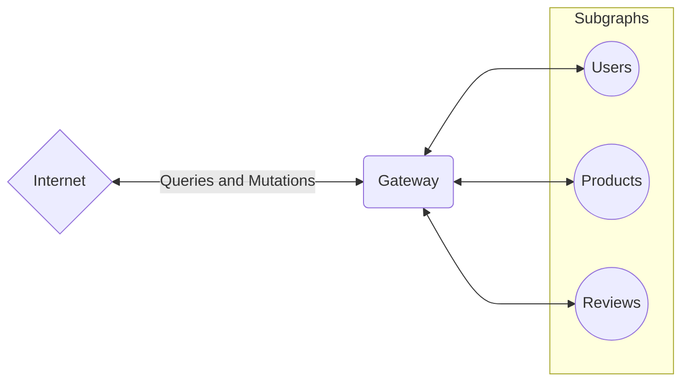

# Spec Agnostic Executor for Federated GraphQL

A Zero-Dependency Approach to Planning & Executing Federated Schemas

  
  

    
Denis Badurina

    <small class="opacity-50">
      Software Architect @ <a href="https://the-guild.dev/">The Guild</a>
    </small>
    <small>
      <grommet-icons-github /> <a href="https://github.com/enisdenjo">@enisdenjo</a>
       
      <grommet-icons-twitter /> <a href="https://github.com/enisdenjo">@enisdenjo</a>
    </small>
  

---

# Hi! 👋

I am Denis

- From The Guild, we do OSS well. Visit us at [the-guild.dev](https://the-guild.dev/)
- `@enisdenjo` handle _everywhere_
- I create and solve problems

---

# What is Federated GraphQL?

Allows multiple services (subgraphs) to work together to present a single, unified GraphQL API

**Management**

Each service manages its own part of the schema (e.g., users, products) while still contributing to the overall API.

**API**

Clients interact with one endpoint, but queries are resolved across multiple services.

**Relationships**

Services can reference fields and types from other services, enabling complex, multi-service queries.

**Coordination**

A GraphQL Gateway compiles and delegates queries to the appropriate services, ensuring seamless execution.

<!--
- Let's start by saying that a federated GraphQL connects multiple services to work together to present an unified GraphQL API

- This allows for a few interesting things

-->

---

---

# What is Federated GraphQL?

Why Federation Matters

- Service Independence
- Improved Scalability
- Faster Iteration

<!--
- Each team or service can evolve its part of the schema without requiring coordination across the entire organization.
- By splitting the schema into smaller, independently managed services, organizations can scale individual parts of the API without burdening the entire system.
- Teams working on different services can deploy changes to their subgraph independently, allowing for faster iterations and releases.
-->

---

## title: Spec Agnostic Executor for Federated GraphQL

# Spec Agnostic Executor for Federated GraphQL

A Zero-Dependency Approach to Planning & Executing Federated Schemas

  
  

    
Denis Badurina

    <small class="opacity-50">
      Software Architect @ <a href="https://the-guild.dev/">The Guild</a>
    </small>
    <small>
      <grommet-icons-github /> <a href="https://github.com/enisdenjo">@enisdenjo</a>
       
      <grommet-icons-twitter /> <a href="https://github.com/enisdenjo">@enisdenjo</a>
    </small>
  

---

# Hi! 👋

I am Denis

- From The Guild, we do OSS well. Visit us at [the-guild.dev](https://the-guild.dev/)
- `@enisdenjo` handle _everywhere_
- I create and solve problems

---

# What is Federated GraphQL?

Allows multiple services (subgraphs) to work together to present a single, unified GraphQL API

**Management**

Each service manages its own part of the schema (e.g., users, products) while still contributing to the overall API.

**API**

Clients interact with one endpoint, but queries are resolved across multiple services.

**Relationships**

Services can reference fields and types from other services, enabling complex, multi-service queries.

**Coordination**

A GraphQL Gateway compiles and delegates queries to the appropriate services, ensuring seamless execution.

<!--
- Let's start by saying that a federated GraphQL connects multiple services to work together to present an unified GraphQL API

- This allows for a few interesting things

-->

---

---

# What is Federated GraphQL?

Why Federation Matters

- Service Independence
- Improved Scalability
- Faster Iteration

<!--
- Each team or service can evolve its part of the schema without requiring coordination across the entire organization.
- By splitting the schema into smaller, independently managed services, organizations can scale individual parts of the API without burdening the entire system.
- Teams working on different services can deploy changes to their subgraph independently, allowing for faster iterations and releases.
-->
